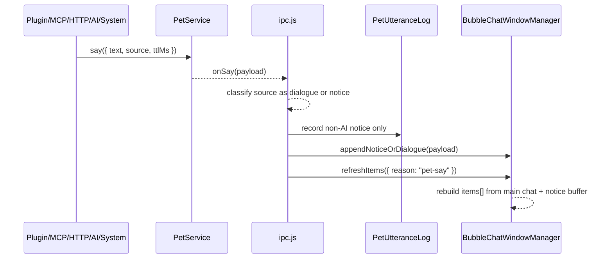
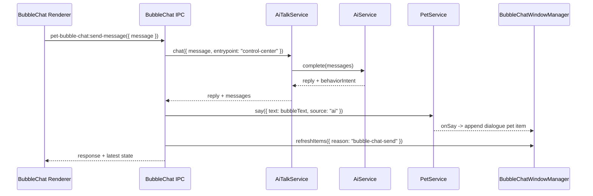
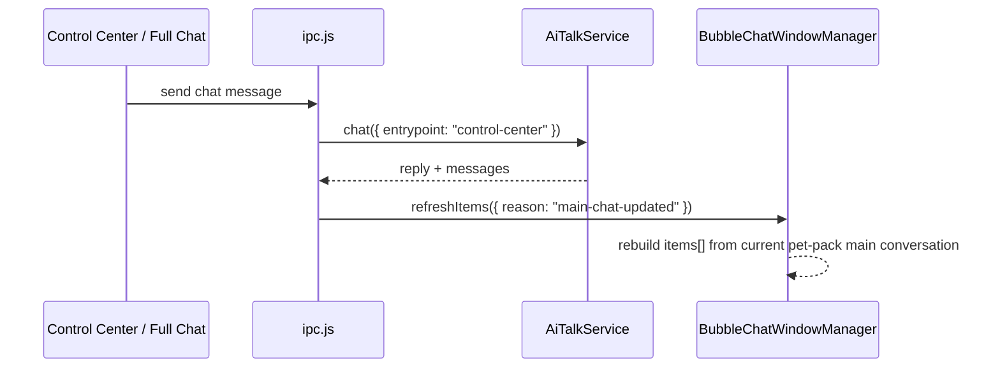

# OpenPet Pet Bubble Chat Popup 开发文档

日期：2026-06-24
基线：`codex/bubble-chat-runtime-verify@779c76a` (`feat(phase-1): add bubble chat item model`)
状态：v3 设计已更新；Phase 1 消息模型已开始落地，后续实现必须以本文档的“透明迷你对话流 v3”边界为准

## Milestone 执行契约

```text
Milestone：Pet Bubble Chat 透明迷你对话流 v2
目标：在不替代完整桌面聊天窗的前提下，把 BubbleChatWindow 从最新一句 popup 升级为锚定宠物头顶的透明迷你对话流；它显示最近 4-6 轮用户/宠物正式对话，同时把插件、HTTP、MCP、renderer 等非 AI 发声作为轻提示展示，并通过折叠迷你输入框复用当前 AI Talk 主会话发送消息。
P0/P1 范围：透明 BubbleChatWindow；透明区域点击穿透；最近主会话裁剪视图；dialogue/notice 消息分类；Pet 页开关；pet utterance log；AI Talk recent pet activity 注入；popup 定位、TTL、auto-hide、pin/interacting；迷你输入发送链路；必要单元/IPC/renderer/Control Center 回归。
不做的 P2/P3：流式回复；完整历史浏览；外观主题/位置自定义；消息队列轮播；插件消息优先级 UI；外部点击自动 unpin；高级隐私模式；多会话 UI；让插件/HTTP/MCP 默认写入主 chat messages。
Manual-required：真实 Electron 桌面跨屏/贴边/拖拽体验；真实 AI provider 端到端聊天体验；高频 say 打扰程度的人眼产品验收。
阶段上限：4
阶段拆分：Phase 1 消息模型与上下文边界；Phase 2 透明窗口与点击穿透；Phase 3 迷你对话流渲染；Phase 4 迷你输入闭环与验证。
验收标准：Pet 页可开关；开启后所有 petService.say() 触发 BubbleChatWindow；透明空白区域不挡宠物；AI/user 显示为正式对话流；plugin/http/mcp/pet-renderer 默认显示为轻提示；迷你输入可发送并复用 control-center:{petPackId}:main；pet utterance 只作为 short-term recent activity，不进入主 transcript 和 memory extraction。
停止条件：P0/P1 完成并通过必要验证；阶段数量达到 4；P0/P1 阻断项 3 次修复仍失败；真实桌面或真实 provider 依赖阻断最终验收。
```

## 本次更新摘要

- 产品形态明确为“透明迷你对话流 v2”：只保留宠物头顶/周边的 BubbleChatWindow；旧宠物窗口 inline `#bubble` 不再作为第二个可见聊天框。
- 对话内容分为 `dialogue` 和 `notice`：AI/user 主会话消息是正式 dialogue，插件/HTTP/MCP/pet-renderer/event 默认是 notice。
- `BubbleChatWindow` 不维护第二套正式 transcript；它从当前 active pet-pack 的 `control-center:{petPackId}:main` 主会话裁剪最近 4-6 轮，并叠加少量 notice buffer。
- `showMessage()` 必须保留为兼容入口；内部可以转为 `appendNoticeOrDialogue()`，避免一次性打断现有 renderer、IPC 和测试调用点。
- 一期不开放外部 `intent: 'dialogue' | 'notice'` schema；插件/HTTP/MCP 写入主会话需要后续单独权限设计。
- 透明空白区域不挡宠物属于窗口级交互问题，必须在 Phase 2 通过 `setIgnoreMouseEvents(..., { forward: true })` 或动态 bounds 处理，不能只靠 CSS。
- 展示时长按“轻聊天可读”处理：默认最短 6s，最长 30s；动作切换、pet renderer 本地提示和高频 say 不得直接打断或隐藏当前气泡。

## v2 硬性不变量

这些约束用于后续代码 review、测试和人工验收；任一条回退都视为当前 milestone 的 P0/P1 阻断项。

- **单一轻聊天承载**：用户可见的轻量聊天只在 BubbleChatWindow 内出现；旧宠物窗口 inline `#bubble` 只能作为兼容 DOM 或过渡钩子，不得显示第二个下方框。
- **透明点击穿透**：透明空白区域必须允许宠物拖拽、双击和右键菜单继续命中宠物窗口；只有真实气泡内容、操作按钮、文本选择区和迷你输入区可交互。
- **同一主会话**：BubbleChatWindow、完整桌面聊天窗、Control Center AI 页必须共享当前 active pet-pack 的 `control-center:{petPackId}:main` conversation。
- **默认来源分类稳定**：`source: 'ai'` 是正式 dialogue；插件、HTTP、MCP、pet-renderer、AI behavior、event message 和 smoke 默认是 notice。外部 `intent` 字段一期不生效。
- **不污染记忆**：非 AI say 只能进入 pet utterance log 和 short-term recent activity，不进入主 transcript，不触发长期记忆抽取。
- **可读优先**：TTL、auto-hide、动作播放和新 notice 不能让用户正在阅读、复制或输入的内容消失；hover/focus/selection/draft/sending/error 都必须定格。
- **日志脱敏**：BubbleChat 相关日志允许记录 source、字符数、状态、耗时和错误分类，不记录完整用户输入、完整宠物文本、prompt、memory 或 API key。

## 阶段边界原则

- Phase 1 只落消息模型、source 分类、notice buffer、主会话裁剪刷新边界和兼容入口，不改变外部协议 schema，不重做 renderer 视觉。
- Phase 2 解决独立透明窗口、锚定、点击穿透、自动隐藏、交互定格和 Pet 页开关，让窗口不会遮挡宠物。
- Phase 3 解决透明迷你对话流的真实渲染、旧 inline bubble 下线、双击宠物打开同一 BubbleChatWindow 和多入口刷新一致性。
- Phase 4 解决迷你输入发送闭环和端到端验证，确保 BubbleChatWindow、完整聊天窗、Control Center AI 页共享同一主会话。
- 每个阶段只处理自己的 P0/P1 阻断项；流式回复、外观自定义、完整历史浏览、插件 `intent` 权限模型都保持在 Backlog。

## 范围分级

### P0

- 不破坏 `npm start`、普通宠物窗口、完整桌面聊天窗、Control Center AI 页和现有 `petService.say()` 行为。
- API key、完整 prompt、完整用户输入和完整 memory 不得暴露到 renderer、普通插件或默认日志。
- BubbleChatWindow 必须通过主进程 IPC 复用 AI Talk，不允许 renderer 直接访问 provider。
- 旧宠物窗口 inline `#bubble` 不得重新成为第二个可见聊天框；可保留 DOM/兼容入口，但展示统一汇总到 BubbleChatWindow。

### P1

- Pet 页新增“头顶轻聊天 Popup”设置并可持久化。
- 所有 `petService.say()` 进入 BubbleChatWindow 展示链路，宠物 renderer 本地提示也通过 `showBubbleChatMessage()` 汇总到同一窗口。
- 非 AI say 记录为独立 pet utterance，并注入 AI Talk recent pet activity。
- BubbleChatWindow 单例、锚定宠物上方、自动隐藏、交互定格。
- BubbleChatWindow 渲染最近 4-6 轮 dialogue items 和少量 notice items，形成透明迷你对话流。
- 默认折叠迷你输入框，发送后写入当前 pet-pack 主会话。
- 覆盖必要测试：settings 合并、utterance log、AI Talk 注入、window manager、透明点击穿透、IPC send path、Control Center 开关。

### P2/P3 Backlog

- popup 主题、尺寸、透明度、位置偏移自定义。
- 完整历史浏览、收藏、搜索、富文本、Markdown 渲染。
- 流式回复、取消生成、队列轮播、消息优先级。
- AI Talk 插件扩展点与插件侧轻聊天策略。
- 高级隐私模式和用户审批式记忆写入。

### Manual-required

- 多屏、刘海屏、系统缩放、拖拽中定位和 focus 抢占需要真机观察。
- 真实 AI provider 延迟、错误码、限流、模型行为需要用户配置的 provider 实测。
- 高频插件/MCP/HTTP say 是否过吵，需要产品体验确认。

## 背景

OpenPet 现在已有三类与宠物说话相关的能力：

- 旧宠物窗口 inline bubble：`index.html` 里仍有 `#bubble` 兼容节点，但当前目标是不再让它成为第二个可见聊天框。
- 完整桌面聊天窗：独立 `BrowserWindow`，由 `PetChatWindowManager` 管理，承载较重的历史对话和输入。
- AI Talk：`AiTalkService` / `AiTalkStore` 负责当前 pet-pack 的人格、主会话、长期记忆、动作建议和统一聊天状态。

新的 Pet Bubble Chat Popup 是第四层能力：一个独立轻量窗口，锚定在宠物上方，用于即时阅读宠物说话并快速回复。它不替代完整聊天窗，也不把现有宠物 renderer 变成复杂聊天 UI。

## 用户目标

用户希望可以在不打开完整聊天面板的情况下，直接在宠物上方进行轻量对话：

- 用户和宠物可以在透明头顶气泡里一言一语交流，不需要先打开完整桌面聊天窗。
- 宠物、插件、MCP、本地 HTTP 或 AI 触发 `petService.say()` 时，头顶轻聊天 popup 自动出现。
- popup 根据文本量自动决定展示时长。
- 如果用户没有操作，到期自动消失。
- 如果用户 hover、点击、选中文本、聚焦输入框或正在输入，popup 定格，方便复制或继续对话。
- popup 带迷你输入框，但默认折叠；双击宠物默认打开同一个透明迷你对话流。
- Control Center 的 `Pet` 页可以关闭这个轻聊天 popup。

## 非目标

- 不替代完整桌面聊天窗。
- 不在 BubbleChatWindow 显示完整聊天历史，只显示最近 4-6 轮轻量对话。
- 不恢复宠物窗口内旧 inline bubble 作为第二个可见聊天框。
- 不让插件、MCP、本地 HTTP 默认写入 AI Talk 主会话 messages。
- 不让普通插件获得新的非授权 AI 能力。
- 不做流式回复；后续 AI Talk 支持流式后再接入。
- 不做多会话列表、历史搜索、消息收藏或富文本渲染。

## 已确认产品决策

- 新增独立轻量 `BubbleChatWindow`，锚定宠物上方或周边。
- BubbleChatWindow 升级为“透明迷你对话流”，显示最近 4-6 轮用户/宠物正式对话。
- 默认 popup，不常驻。
- 所有 `petService.say()` 都触发 popup。
- 设置开关放在 `Pet` 页，命名建议为“头顶轻聊天 Popup”。
- popup 带迷你输入框，默认折叠；用户 hover/click/focus 后展开。
- BubbleChatWindow 的历史来源以 AI Talk 主会话最近消息为准，不维护第二套正式聊天历史。
- `source: 'ai'` 的 `petService.say()` 默认作为 dialogue 显示；插件、HTTP、MCP、pet-renderer、AI behavior 和 event message 默认作为 notice 显示。
- 一期不扩展 `PetService.say()`、HTTP、MCP 或插件 SDK payload schema；`intent: 'dialogue' | 'notice'` 只作为后续兼容扩展预留。
- 透明空白区域不挡宠物，必须通过主进程窗口级命中策略或动态窗口 bounds 实现；CSS `pointer-events` 只能作为 renderer 内部辅助。
- 非 AI 来源的 `petService.say()` 进入独立 pet utterance log。
- AI Talk 构造上下文时读取最近少量 pet utterance，作为带来源标记的 recent pet activity。
- pet utterance 不直接写入主 chat messages，不触发长期记忆抽取。

## v3 设计更新摘要

- 轻聊天不再是“最近几条消息的 popup 列表”，而是宠物头顶附近的**透明迷你对话流**：用户右侧发言、宠物左侧回复、底部始终保留一个可重新输入的输入气泡。
- 用户发送后，当前输入气泡立刻转为右侧历史气泡并上浮入列；底部马上再生成一个新的输入气泡，不要求用户等待宠物回复。
- 宠物允许对用户连续两三句进行近实时合并理解，在上游变慢、失败或超时后，把多条待回复用户气泡合并到下一轮请求中，再回一条综合回复。
- 迷你流只保留最近一小段真实气泡历史，默认可见 6-8 条，超出后按最旧优先逐条淡出；每条历史气泡有自己的独立可见时钟。
- 若底部输入气泡仍活跃，或用户 hover / focus / 选中文本，则暂停旧气泡淡出，避免“刚想看就消失”。
- 超时或失败时，不把失败轮次直接吞掉：未被回复的右侧用户气泡继续保留在栈内，标记为待补发/待合并；底部输入气泡给出轻错误提示，用户下一次输入会自动带上这些 pending 内容。
- 最近消息的“回看”依然通过真实悬浮气泡完成，不额外加历史抽屉；完整 transcript 继续由现有完整聊天窗承载。

## v2 透明迷你对话流

v2 的核心变化是：BubbleChatWindow 不再只是“最新一句通知”，而是一个透明、短历史、可快速回复的迷你对话流。它仍然不是完整聊天窗；它只承担宠物头顶附近的即时交流体验。

### 消息类型

BubbleChatWindow renderer 统一渲染 `items[]`，每个 item 至少包含：

```ts
interface BubbleChatItem {
  id: string
  kind: 'dialogue' | 'notice'
  role: 'user' | 'pet' | 'system'
  text: string
  source: string
  createdAt: string
  conversationId?: string
  messageId?: string
  status?: 'sending' | 'sent' | 'failed'
}
```

分类规则：

- `kind: 'dialogue'`：用户通过 BubbleChat/完整聊天窗/Control Center 发送的主会话消息，以及 `source: 'ai'` 的正式宠物回复。
- `kind: 'notice'`：插件、HTTP、MCP、pet-renderer、本地事件、AI behavior、packaged smoke 等发来的状态类文本。
- `role: 'pet'`：AI 回复和可人格化的宠物文本。
- `role: 'user'`：用户输入的消息。
- `role: 'system'`：notice 中不应被理解为宠物人格对白的状态信息。

### 历史来源

BubbleChatWindow 不创建独立正式 transcript。它的 dialogue items 来自当前 active pet-pack 的 AI Talk 主会话：

```text
conversationId = control-center:{petPackId}:main
```

展示时只裁剪最近 4-6 轮，避免把轻窗口变成完整聊天窗。非 AI 的 `petService.say()` 不写入主会话 messages，只作为 notice item 展示，并继续写入 pet utterance log，供 AI Talk 作为 recent pet activity 注入下一次 provider request。

主进程必须定义统一的 `refreshBubbleChatItems()` 同步点，由 `ipc.js` 或注入给 `PetBubbleChatWindowManager` 的 helper 负责读取当前 active pet-pack 主会话并重建 `items[]`。至少在以下事件后调用：

- BubbleChatWindow 发送消息开始、成功、失败；
- Control Center AI 页发送消息成功；
- 完整桌面聊天窗发送消息成功；
- `petService.say({ source: 'ai' })` 产生正式宠物回复；
- `petService.say()` 或 `petService.setEvent({ message })` 产生 notice；
- active pet-pack 切换或主会话被清空；
- BubbleChatWindow 手动打开时。

这样 BubbleChatWindow 是同一主会话的裁剪视图，而不是只在自己的发送路径更新。

### `petService.say()` 业务方归类

当前已确认的业务方：

| 业务方 | 当前入口证据 | 默认 kind | 默认 role | 是否写主会话 | 是否写 pet utterance |
| --- | --- | --- | --- | --- | --- |
| AI Talk 主回复 | `src/main/ipc.js` 调用 `petService.say({ source: 'ai' })` | `dialogue` | `pet` | 是，由 AI Talk 写入 | 否，避免重复记录正式回复 |
| AI behavior | `src/main/ipc.js` 调用 `petService.say({ source: 'ai:behavior' })` | `notice` | `system` | 否 | 是 |
| Local HTTP | `src/main/services/local-http-service.js` 的 `POST /api/pet/say` | `notice` | `system` | 否 | 是 |
| MCP | `src/main/services/mcp-transport-service.js` 的 `openpet.say` / legacy `ibot.say` | `notice` | `system` | 否 | 是 |
| 插件 JS SDK | `src/main/services/plugin-service.js` 的 `ctx.pet.say()` | `notice` | `system` | 否 | 是 |
| 插件 command bridge | `src/main/services/plugin-service.js` 声明式 `pet.say` | `notice` | `system` | 否 | 是 |
| 宠物 renderer 本地提示 | `renderer.js` 的启动、散步、点击动作 label 等 `showBubbleChatMessage()` | `notice` | `system` | 否 | 是 |
| `petService.setEvent({ message })` | `src/main/ipc.js` event message 分发 | `notice` | `system` | 否 | 是 |
| Packaged runtime smoke | `src/main/packaged-runtime-smoke-runner.js` | `notice` | `system` | 否 | 否，可作为测试/诊断噪声过滤 |

后续扩展：插件、HTTP、MCP 可以显式传入 `intent: 'dialogue' | 'notice'`。一期不开放该字段，不修改外部协议 schema，也不开放主会话写入；是否写入 AI Talk 主 messages 需要单独权限和产品确认。

### 透明视觉与点击穿透

视觉目标：气泡应像悬浮在宠物头顶的半透明玻璃对话层，而不是实体设置卡片。背景可以使用轻 blur、透明填充和细描边，但整体应保持 pet sprite 可见，不制造第二个厚重窗口。

交互目标：透明空白区域不挡宠物。因为 BubbleChatWindow 是独立 Electron `BrowserWindow`，透明区域会先参与系统级窗口命中；不能只依赖 CSS `pointer-events`。Phase 2 必须采用以下两种策略之一，并在测试/人工验收中验证：

1. **动态窗口级穿透**：当输入框未 focus、未拖选文本、未 hover 可见气泡时，主进程调用 `bubbleWindow.setIgnoreMouseEvents(true, { forward: true })`；当鼠标进入可见气泡 hit area、输入框展开或窗口需要交互时切回 `false`。
2. **动态 bounds 收缩**：窗口 bounds 尽量贴合实际气泡内容和输入区，避免大面积透明区域覆盖宠物；气泡内容尺寸变化、输入框展开、notice 增减时重新计算 bounds。

CSS hit area 仍用于 renderer 内部控制：

```css
html,
body,
.bubble-shell {
  background: transparent;
  pointer-events: none;
}

.bubble-card,
.bubble-card * {
  pointer-events: auto;
}
```

需要注意：输入框展开、文本选择、按钮点击和滚动区域必须保持可交互；视觉上透明的空白区域不能拦截宠物拖拽、双击和右键菜单。若采用窗口级穿透，renderer 需要通过 IPC 上报可交互状态，manager 再切换 `setIgnoreMouseEvents`。

## 本轮模块划分结论

本轮新增能力不是把现有聊天功能再做一遍，而是把 OpenPet 的对话体验拆成三层，各层只承担自己擅长的交互重量：

1. 宠物窗口：继续负责 sprite、动作、拖拽、右键菜单、鼠标穿透和双击入口；旧 inline bubble 只保留兼容节点，不承担可见聊天 UI。
2. 透明迷你对话流 BubbleChatWindow：独立 Electron `BrowserWindow`，锚定宠物上方或周边，默认 popup；承接所有 `petService.say()`、pet renderer 本地提示和快速回复。它可以选中文本、复制、定格、折叠输入，并显示最近 4-6 轮一言一语。
3. 完整桌面聊天窗：继续作为重聊天入口，承载完整历史、较长对话、后续流式回复、多会话和更完整的聊天控制。BubbleChatWindow 复用同一条 AI Talk 主会话，不另开一套聊天系统。

最终边界：

- `PetService` 仍是宠物状态与发声唯一入口，所有宠物说话都必须从 `petService.say()` 进入。
- `ipc.js` 是主分发点，负责把一次 say 送到 BubbleChatWindow 和完整聊天状态，并只把非 AI notice 写入 pet utterance log；旧 `PET_SAY` 只用于兼容 renderer 监听，不再驱动第二个可见聊天框。
- `AiTalkService` 是对话智能核心，BubbleChatWindow 只通过主进程 IPC 复用它，不直连 provider。
- `PetBubbleChatWindowManager` 是轻聊天窗口唯一状态源，负责 popup 生命周期、定位、TTL、pin/interacting、发送中/错误 UI 状态和 `items[]` 裁剪视图。
- Control Center 的 Pet 页只提供开关和基础行为设置，不承载轻聊天运行时状态。

## 基于最新 main 的聊天收口迁移

这部分不是重新定义产品，而是把真实 `main` 的过渡状态和 v2 目标接上，避免后续开发再次回到“双主入口”。

### main 当前真实状态

基于真实 `main` 分支代码读取：

- `src/main/pet-bubble-chat-window.js` 已经存在独立透明 `BrowserWindow`，但仍带有较强的“单条消息 popup”历史包袱。
- `src/main/pet-chat-window.js` 仍是一套完整独立聊天窗，支持 bounds、top-most、设置入口和发送消息。
- `renderer.js` 中宠物双击默认已走 BubbleChat 打开入口。
- `ipc.js` 中 AI 完成后会调用 `petService.say({ source: 'ai' })`，而 `petService.onEvent(...)` 又会把 say/event message 继续送给 bubble chat。
- 结果是：运行时已经开始向 BubbleChat 倾斜，但产品语义还没有彻底收口，桌面聊天窗和 bubble chat 仍然像两套并列主聊天体验。

### 收口决定

后续聊天产品统一按以下原则推进：

1. `BubbleChatWindow` 是默认聊天入口。
2. `PetChatWindow` 是扩展聊天面板，不再作为并列默认入口。
3. 所有轻量对话、宠物提示、短追问都优先汇总到 BubbleChatWindow。
4. 完整桌面聊天窗只承接长历史、较重输入和后续高级能力。

### 迁移后职责边界

#### BubbleChatWindow

- 透明迷你对话流。
- 默认 popup。
- 宠物双击默认打开。
- 承接所有 `petService.say()` 的轻展示。
- 渲染最近 4-6 轮主会话 dialogue 和少量 notice。
- 提供折叠迷你输入框。

#### PetChatWindow

- 不再承担“默认聊天入口”语义。
- 保留独立窗口、拖动、尺寸、置顶和设置入口。
- 作为长历史查看、完整输入、后续流式回复和开发/调试视图的承载面板。

#### PetService.say()

- 继续是所有宠物发声的统一入口。
- AI、插件、MCP、HTTP、renderer、本地事件都从这里进入。
- UI 收口发生在 say 之后的主进程分发层，而不是放开多个业务方自行控制不同聊天窗口。

### 必须维持的兼容规则

- 不删除 `PetChatWindow`，只调整产品定位。
- 不让桌面聊天窗分叉出第二套 provider 调用或第二套 transcript。
- 不恢复旧 inline `#bubble` 为第二个可见聊天框。
- 不修改插件/HTTP/MCP 一期 payload schema 去直接写 `dialogue`。
- `showMessage()`、`PET_BUBBLE_CHAT_SHOW_MESSAGE` 这类兼容入口继续保留，但内部语义对齐到统一的 BubbleChat item 流。

### 迁移后的入口语义

| 入口 | 默认行为 | 备注 |
| --- | --- | --- |
| 宠物双击 | 打开 BubbleChatWindow | 默认主入口 |
| `petService.say()` | 刷新 BubbleChatWindow | 所有轻量说话统一收口 |
| Control Center AI 页发送 | 写主会话并刷新 BubbleChatWindow + 桌面聊天窗 | 不再只偏向桌面聊天窗 |
| 桌面聊天窗发送 | 写主会话并刷新 BubbleChatWindow | 桌面窗不是独立脑 |
| 手动打开桌面聊天窗 | 查看扩展历史/重输入 | 次级入口 |

### 对后续实现的约束

- 新功能若涉及“和宠物说一句话”，默认先问自己是否应走 `PetService.say()` + BubbleChatWindow，而不是新开一个聊天 UI。
- 新功能若涉及“正式会话消息”，默认先写入当前 active pet-pack 的主会话，再让 BubbleChatWindow 从主会话裁剪显示。
- 新功能若只是状态提示或插件回执，默认作为 notice，不直接进入 transcript。

## 用户交互模型

### 默认 popup

BubbleChatWindow 默认不常驻。有新宠物发言时自动出现；没有用户操作时按消息长度自动隐藏。隐藏只隐藏窗口，不销毁实例，下一次消息复用窗口。

### 用户操作后定格

以下行为会让 popup 定格，避免用户正读、正复制或正输入时窗口突然消失：

- 鼠标进入窗口；
- 点击卡片或操作按钮；
- 选中文本；
- 聚焦迷你输入框；
- 输入框存在草稿；
- 消息正在发送；
- 发送失败，需要保留错误提示。

一期通过 Esc、关闭按钮、发送成功后的空草稿状态恢复自动隐藏。点击外部自动 unpin 放入 backlog，避免先把桌面焦点问题做复杂。

### 迷你输入框

迷你输入框默认折叠，只露出轻量入口。hover、click、focus 或开始输入后展开。Enter 发送，Shift+Enter 换行，Esc 优先收起/清空草稿，空草稿时隐藏 popup。

发送成功后：

- 用户消息和助手回复写入当前 active pet-pack 的 AI Talk 主会话；
- 助手回复继续通过 `petService.say({ source: 'ai' })` 触发 BubbleChatWindow，并刷新透明迷你对话流；
- Control Center AI 页和完整桌面聊天窗读取同一条 `control-center:{petPackId}:main` 会话历史。

发送失败后：

- popup 保持可见；
- 输入框保留或恢复用户草稿；
- UI 展示脱敏错误；
- 日志只记录错误分类、字符数和耗时，不记录用户原文。

## v3 透明迷你对话流交互模型

v2 解决的是“BubbleChat 取代旧下方框，成为唯一轻聊天承载面”。v3 在此基础上进一步明确真实桌面交互，目标不是一个小型聊天面板，而是围绕宠物头顶生成、上浮、淡出的透明对话流。

### 视觉与空间模型

- 默认锚点沿用当前 BubbleChatWindow 的宠物头顶位置，不额外创建新的默认区域。
- 窗口仍是独立透明 `BrowserWindow`，但视觉上应尽量表现为一串悬浮气泡，而不是包裹这些气泡的实体底板。
- 用户气泡在右侧；宠物气泡在左侧；底部输入气泡位于对话流最下方。
- 只有真实气泡内容区和输入区可点击；透明空白区域继续点击穿透，不得形成一个大矩形遮罩挡住宠物。
- 用户临时拖拽后允许偏离默认锚点；一旦宠物位置发生变化，迷你流回到宠物头顶默认锚点，避免长期漂移导致“聊天和宠物脱节”。

### 底部输入气泡模型

底部并不是固定输入栏，而是一个可复用的“输入气泡槽位”：

1. 初始状态显示一个折叠或轻展开的输入气泡。
2. 用户输入并发送后，这个输入气泡立即转为一条普通右侧用户气泡。
3. 同一时刻，在底部重新生成一个新的输入气泡。
4. 如果当前仍在等待宠物回复，新输入气泡进入 `waiting` 状态，但不阻止继续输入下一句。

这样做的原因是让用户看到“我的话已经进入对话流”，而不是输入框原地清空后等待远端返回。

### 连续追发与合并回复策略

默认策略是近实时回复，但不强制一问一答锁步：

- 用户可以连续发送第二句、第三句；每次发送都立即形成新的右侧历史气泡并上浮。
- 上游回复很快返回时，宠物正常追上一条左侧回复。
- 上游延迟较长、上一轮失败或上一轮尚未产出正式回复时，系统允许把多条连续用户气泡合并进下一次请求。
- 宠物可以只回一条综合回复，覆盖这几条连续用户输入。
- 一旦成功回复，这一批待回复用户气泡全部从 `pending-merge` 恢复为普通历史用户气泡。

这条规则必须同时满足两个产品目标：一是桌面宠物应接近实时；二是慢模型或失败时不能把用户的后续输入锁死。

### 气泡状态机

建议把迷你流中的气泡状态收敛为以下有限集合：

```ts
type BubbleFlowItemState =
  | 'draft'
  | 'waiting'
  | 'sent'
  | 'pending-merge'
  | 'replied'
  | 'fading'
  | 'hidden'
```

语义：

- `draft`：底部当前输入气泡，用户尚未发送。
- `waiting`：用户刚发送后，新底部输入气泡处于等待上一轮宠物结果的轻占位状态，可显示很轻的 `...` 或“宠物正在回复…”。
- `sent`：右侧用户气泡已进入历史栈，但本轮是否已被宠物消费尚未最终确认。
- `pending-merge`：该用户气泡所在轮次超时或失败，等待与后续输入合并后重发。
- `replied`：已有对应宠物回复或综合回复落地，成为普通历史气泡。
- `fading`：达到自身淡出时间，进入淡出动画。
- `hidden`：淡出后从可见栈移除，但完整历史仍保留在共享主会话或轻历史缓存中。

### 失败与待补发行为

失败路径按以下交互处理：

- 用户刚发送时，右侧气泡先正常入列，不因远端失败而回滚消失。
- 等待上游短暂返回时，这些右侧气泡可显示一个非常轻的 `...` 或呼吸态，不要做重 loading 卡片。
- 若达到失败/超时阈值：
  - 底部输入气泡显示“宠物刚才没接住，再试一次”之类的轻提示；
  - 尚未被回复的右侧用户气泡标记为 `pending-merge`；
  - 这些气泡继续留在栈里，不丢失、不自动折叠成系统提示。
- 用户继续输入后，所有 `pending-merge` 气泡与新输入一起并入下一轮请求。
- 下一轮只要宠物成功回复，这些 pending 气泡就回归普通历史，不再保留错误态。

### 可见历史与逐条淡出规则

迷你流保留的是“最近几条真实气泡”，不是一个可滚动的完整面板。

- 默认同时保留最近 `6-8` 条真实历史气泡，后续可通过设置调整。
- 每条历史气泡有自己的独立 fade timer，默认显示 `6-8s`。
- 若总数超过可见上限，最早的气泡优先进入 `fading`。
- 若底部输入气泡持续活跃，或用户 hover / focus / selection，则暂停旧气泡继续淡出。
- 当 `8-12s` 内没有新输入、没有 hover、没有 focus 时，顶部最老气泡开始逐条淡出。
- 输入气泡本身不参与普通历史淡出规则；它是常驻交互槽位。

### 最近消息回看与完整历史分工

- 迷你流自己保存最近一小段真实悬浮气泡，供用户直接回看桌面上的最近交流。
- 不再单独设计一个“历史按钮打开迷你面板”。
- 若用户需要完整上下文、长文本、更多历史或更重的聊天操作，继续打开现有完整聊天窗。
- 因此需要明确区分三层数据：
  - **共享主会话 transcript**：完整聊天窗和 Control Center 共用的正式会话。
  - **迷你流可见气泡栈**：桌面当前短历史的视觉子集。
  - **待补发/待合并队列**：尚未被宠物正式接住的连续用户输入。

### transcript 映射原则

v3 不引入第二套正式聊天存储，但需要明确 mini flow 和主 transcript 的映射：

- 用户每次点击发送，仍然作为独立 `user` message 写入当前 active pet-pack 主会话。
- 宠物成功回复时，作为一条 `assistant` message 写入主会话。
- 若宠物把连续两三句用户输入合并理解后回一条综合回复，主会话中仍保留那几条独立用户 message，不做事后拼接改写。
- `pending-merge` 是迷你流运行时状态，不改变主会话里这些用户消息已存在的事实。
- 失败轮次若最终没有获得宠物正式回复，也不删除这些 user messages；完整聊天窗应如实显示为“用户说过，但宠物那轮没接住”。

这个映射是为了保证：桌面轻交互可以聪明合并请求，但主会话仍然是可审计、可回看的真实消息序列。

## 当前架构事实

### 宠物窗口

文件：

- `index.html`
- `renderer.js`
- `preload.js`
- `src/main/window.js`

当前旧 inline bubble 是 `index.html` 内的 `#bubble`，历史上由 `renderer.js.say()` 控制。v2 以后宠物窗口不再展示这个 inline bubble；renderer 本地 `say()` 通过 preload 调用 `showBubbleChatMessage()`，统一汇总到 BubbleChatWindow。宠物窗口是透明、无边框、不可 resize、置顶的 Electron `BrowserWindow`，仍负责宠物拖拽、命中区、鼠标穿透、自定义 cursor、右键菜单、动作播放和窗口 viewport resize。

因此，轻聊天输入框不应直接塞进宠物 renderer。输入框需要可聚焦、可选择文本、可复制，这会显著增加宠物透明窗口和命中区复杂度。

### 完整桌面聊天窗

文件：

- `src/main/pet-chat-window.js`
- `src/main/pet-chat-preload.js`
- `src/main/pet-chat/index.html`
- `src/main/pet-chat/renderer.js`
- `src/main/pet-chat/styles.css`

完整聊天窗已经是独立 `BrowserWindow`，具备持久 bounds、置顶设置、发送消息、设置入口和统一聊天状态广播。

BubbleChatWindow 应借鉴它的窗口管理模式，但保持更小的职责：透明迷你对话流、少量 notice、迷你输入、自动隐藏、定格。

### 统一聊天状态

文件：

- `src/main/ipc.js`
- `src/shared/openpet-contracts.ts`
- `src/control-center/src/hooks/useAiPane.ts`
- `src/control-center/src/panes/AiPane.tsx`

`ipc.js` 已聚合 `PetChatState`，包括：

- 当前 pet-pack；
- AI provider readiness；
- 最新宠物气泡和 BubbleChatWindow 迷你流所需的最近主会话消息；
- 当前 pet-pack 主会话 messages；
- 完整桌面聊天窗状态。

BubbleChatWindow 应复用同一套发送链路和 AI Talk 会话，不再创建第二套 chat service。

## 实现落点清单

### 主进程 composition

文件：

- `main.js`
- `src/main/ipc.js`
- `src/main/window.js`

落点：

- `main.js` 创建 `PetBubbleChatWindowManager` 单例，并注入 `getPetWindow`、`settingsService`、`screen`、`BrowserWindow`、`appLogService` 和共享 AI Talk send helper。
- `ipc.js` 继续作为 `petService.onSay()` 的主分发点：完整聊天状态 bubble、pet utterance log、BubbleChatWindow 都从这里接入；发送到宠物窗口的 `PET_SAY` 仅用于兼容旧监听和日志。
- `window.js` 不承载 BubbleChat 输入 UI，只提供宠物窗口 bounds、move/resize/show/hide/destroy 生命周期可观察入口。

### 主进程服务

文件：

- `src/main/pet-bubble-chat-window.js`
- `src/main/services/pet-utterance-log-service.js`
- `src/main/services/ai-talk-service.js`
- `src/main/services/ai-talk-store.js`
- `src/main/settings.js`

落点：

- `pet-bubble-chat-window.js` 管理独立 Electron popup 单例、定位、TTL、pin/interacting 状态和 renderer state 广播。
- `pet-utterance-log-service.js` 提供 `record()`、`listRecent()`、`clearPetPack()` 等窄 API；底层可以使用 `AiTalkStore.petUtterances`，但调用方不直接操作 store 字段。
- `ai-talk-store.js` 扩展 schema 时保持向后兼容，读取旧数据时补默认值，写入仍使用临时文件 + rename。
- `ai-talk-service.js` 只读取 recent pet activity 并作为短期 system context 注入 provider messages，不把它写进 conversation messages，也不传入 memory extraction。
- `settings.js` 增加 `petBubbleChat` 默认值和 merge 逻辑，旧 settings 自动补齐。

### IPC / preload / renderer

文件：

- `src/shared/ipc-channels.js`
- `src/shared/ipc-channels.ts`
- `src/main/pet-bubble-chat-preload.js`
- `src/main/pet-bubble-chat/index.html`
- `src/main/pet-bubble-chat/renderer.js`
- `src/main/pet-bubble-chat/styles.css`

落点：

- JS/TS IPC channel 文件必须同步新增 `PET_BUBBLE_CHAT_*` 常量。
- preload 只暴露最小 API：getState、hide、setPinned、setInteracting、sendMessage、openFullChat、onStateChanged。
- renderer 只渲染 `items[]`、输入状态和上报用户交互，不读取 settings、不访问 Node、不保存历史。
- 输入框默认折叠；hover/click/focus/draft 时展开并上报 interacting。
- CSS 需要保证透明空白区域 `pointer-events: none`，只有可见气泡内容和输入控件可点击。
- renderer 需要把 hover/focus/selection/draft/sending/error 和可见气泡 hit area 状态上报给主进程，主进程据此切换窗口级 hit-test。

### Control Center

文件：

- `src/shared/openpet-contracts.ts`
- `src/control-center/src/lib/defaults.ts`
- `src/control-center/src/hooks/usePetSettingsPane.ts`
- `src/control-center/src/panes/PetPane.tsx`
- `src/control-center/src/api/control-center-api.ts`

落点：

- `ControlCenterSettings` 新增 `petBubbleChat` 字段。
- default/clone/demo settings 都必须补齐，避免 Playwright demo mode 与 Electron mode 表现不同。
- Pet 页把开关放在聊天/气泡设置附近，关闭只影响 BubbleChatWindow 自动弹出，不影响完整桌面聊天窗；旧 inline bubble 不因此恢复显示。

### 测试

文件建议：

- `tests/services/pet-utterance-log-service.test.js`
- `tests/services/ai-talk-service.test.js`
- `tests/main/pet-bubble-chat-window.test.js`
- `tests/main/pet-bubble-chat-ipc.test.js`
- `tests/main/ipc-cursor-settings.test.js`
- `tests/control-center/control-center-smoke.spec.js`
- `tests/shared/openpet-contracts-type-fixture.ts`

落点：

- 服务测试验证截断、数量上限、pet-pack 隔离和 recent activity 查询。
- AI Talk 测试验证 recent pet activity 注入 provider messages，但不进入 transcript 和 memory extraction。
- window manager 测试验证定位、clamp、TTL、auto-hide、pin/interacting、settings disabled。
- IPC 测试验证 `petService.say()` 分发和 bubble mini input 复用主会话。
- IPC 测试验证 Control Center、完整聊天窗、BubbleChatWindow 三个入口更新同一主会话后都会刷新 BubbleChat `items[]`。
- Control Center 测试验证 Pet 页开关显示、保存、reload 后保留。

## 模块划分

### 1. `PetBubbleChatWindowManager`

建议文件：`src/main/pet-bubble-chat-window.js`

职责：

- 管理 BubbleChatWindow 单例。
- 根据宠物窗口 bounds 计算锚定位置。
- 监听宠物窗口移动、resize、显示、隐藏、销毁并同步 popup 位置。
- 按设置决定是否显示。
- 接收 `petService.say()` 的展示 payload，并按 source 归类为 dialogue 或 notice。
- 保留当前 `showMessage()` 作为外部兼容入口；内部可转调 `appendNoticeOrDialogue()`，避免一次性重命名所有现有 IPC、renderer 和测试调用点。
- 裁剪并缓存 BubbleChatWindow 当前 `items[]` 视图。
- 提供 `refreshItems()` / `rebuildItems()` 能力，从当前 active pet-pack 主会话和 notice buffer 重建视图。
- 计算自动隐藏 TTL。
- 管理 pinned / interacting 状态。
- 管理窗口级 mouse hit-test：根据 renderer 上报的可交互状态切换 `setIgnoreMouseEvents` 或调整窗口 bounds。
- 处理用户未操作时自动隐藏。
- 处理用户操作后取消自动隐藏。
- 向 renderer 广播 state。

不负责：

- AI provider 请求。
- AI Talk 会话存储。
- 旧 inline `PET_SAY` 气泡渲染。
- 插件权限判断。

建议对外接口：

```js
const manager = createPetBubbleChatWindowManager({
  getPetWindow,
  settingsService,
  screen,
  BrowserWindow,
  appLogService,
  sendPetChatMessage,
  openFullChatWindow
})

manager.appendNoticeOrDialogue({
  text,
  source,
  ttlMs,
  petPackId,
  createdAt
})

manager.showMessage(payload) // compatibility wrapper for existing renderer/IPC callers
manager.refreshItems({ reason })
manager.rebuildItems({ conversationMessages, noticeItems, reason })
manager.getState()
manager.hide({ source })
manager.setPinned(pinned, { source })
manager.setInteracting(interacting, { source })
manager.setHitTestMode({ interactive, source })
manager.sendMessage({ message })
manager.syncToPetWindow()
```

### 2. BubbleChat renderer

建议文件：

- `src/main/pet-bubble-chat/index.html`
- `src/main/pet-bubble-chat/renderer.js`
- `src/main/pet-bubble-chat/styles.css`
- `src/main/pet-bubble-chat-preload.js`

职责：

- 展示透明迷你对话流 `items[]`。
- 区分 user/pet dialogue 和 notice 样式。
- 默认折叠迷你输入框。
- hover/click/focus 后展开输入框。
- 支持选中文本和复制。
- Enter 发送，Shift+Enter 换行。
- Esc 收起或隐藏。
- 将 hover/focus/selection/input 状态通知主进程。
- 展示发送中、发送失败和 notice 新消息提示。

不负责：

- 自己决定是否读取 AI provider。
- 自己持久化历史。
- 自己读取或写入 settings。
- 自己定位屏幕坐标。

### 3. BubbleChat IPC

建议新增 IPC channel：

```text
pet-bubble-chat:get-state
pet-bubble-chat:hide
pet-bubble-chat:set-pinned
pet-bubble-chat:set-interacting
pet-bubble-chat:set-hit-test-mode
pet-bubble-chat:send-message
pet-bubble-chat:open-full-chat
pet-bubble-chat:state-changed
```

`pet-bubble-chat:send-message` 不应复制 AI chat 逻辑。它应调用主进程里统一的 `runAiChatRequest()` 或已抽出的 shared send helper，并使用：

```js
{
  source: 'bubble-chat',
  entrypoint: 'control-center'
}
```

说明：

- `source` 用于日志和 UI 诊断。
- `entrypoint` 继续使用 `control-center`，这样 BubbleChatWindow、完整桌面聊天窗和 Control Center AI 页共享当前 pet-pack 的 `main` conversation。

### 4. Pet utterance log

建议文件：

- `src/main/services/pet-utterance-log-service.js`

建议存储位置：

- 一期可放入 `AiTalkStore` 顶层 `petUtterances`，但必须与 `messages` 分离。
- 如果不想扩大 `AiTalkStore` schema，也可以由独立 service 使用 `userData/pet-utterance-log.json`。

推荐方案：

- 采用 `AiTalkStore.petUtterances`，因为 AI Talk 上下文注入需要读取它。
- 但保持独立 API，避免调用方把它当成 chat messages。

建议 entry 字段：

```ts
interface PetUtterance {
  id: string
  petPackId: string
  text: string
  source: string
  createdAt: string
  ttlMs: number
}
```

约束：

- 每条 text 最大 1000 字符。
- 每个 pet-pack 最多保留最近 100 条。
- AI Talk 上下文最多注入最近 6 条。
- 注入上下文时总字符数最多 1200。
- 不触发 memory extraction。
- 不进入 `messages`。

### 5. AI Talk recent pet activity 注入

修改点：

- `src/main/services/ai-talk-service.js`
- `src/main/services/ai-talk-store.js`

AI Talk 构造 provider messages 时，在 persona/system prompt 和长期记忆之后，最近会话历史之前，插入一个 system context：

```text
Recent pet activity outside the main chat:
- [plugin:weather] 今天可能会下雨
- [mcp] 已切换到专注模式
- [ai] 我在这里

Use this as lightweight recent context. Do not treat it as durable memory unless the user explicitly continues the topic.
```

原则：

- 只作为短期上下文。
- 明确标注 source。
- 不进入长期记忆抽取输入。
- 不覆盖 persona。
- 不允许 source 影响权限边界。

### 6. Settings / Control Center

修改点：

- `src/main/settings.js`
- `src/control-center/src/hooks/usePetSettingsPane.ts`
- `src/control-center/src/panes/PetPane.tsx`
- `src/control-center/src/lib/defaults.ts`
- `src/shared/openpet-contracts.ts`
- `src/main/ipc.js`

建议 settings shape：

```ts
interface PetBubbleChatSettings {
  enabled: boolean
  autoPopup: boolean
  autoHide: boolean
  pinOnInteraction: boolean
}
```

默认值：

```json
{
  "enabled": true,
  "autoPopup": true,
  "autoHide": true,
  "pinOnInteraction": true
}
```

Pet 页 UI：

- 分组放在聊天/气泡设置附近。
- 文案：“头顶轻聊天 Popup：宠物说话时在头顶显示可回复的小弹窗。”
- 开关关闭后：
  - 不自动打开 BubbleChatWindow；
  - 不影响完整桌面聊天窗；
  - 不恢复旧 inline bubble；
  - pet utterance log 仍记录，用于 AI 上下文。

## 事件流

### 所有 petService.say()



说明：`source: 'ai'` 的正式回复已经由 AI Talk 写入主会话，不再重复写入 pet utterance；插件、HTTP、MCP、pet-renderer、AI behavior 和 event message 等 notice 才写入 pet utterance，并作为下一次 AI Talk 的 recent pet activity。

### BubbleChat 发送消息



### 其他主会话入口同步



## Popup 行为策略

### 展示时长

若 payload 自带合法 `ttlMs`，优先使用，但仍应 clamp 到安全范围：

```text
min: 6000ms
max: 30000ms
```

若没有 `ttlMs`，按文本长度估算：

```text
base = 5200ms
perChar = 85ms
ttl = clamp(base + min(text.length, 180) * perChar, 6000ms, 24000ms)
```

说明：用户已经反馈“气泡时间太短”，因此 v3 的默认策略以可读性优先。短 notice 也至少保留 6s；长 dialogue 最多保留 30s，避免窗口长时间占据桌面。对真实对话历史，TTL 应视为“进入淡出候选”的最早时间，而不是强制整窗立即消失；用户 hover/focus/selection/draft/sending/error 时，TTL 到期也不隐藏。

### 高频消息

v3 明确放弃“单条覆盖 popup”策略，改为短历史真实气泡流：

- dialogue items 以共享主会话为底，迷你流默认展示最近 6-8 条真实对话气泡，而不是只展示最后 1 条。
- notice items 继续是轻提示，但不能把正式 user/pet dialogue 顶掉；默认最多并存 2-3 条，并优先更早淡出。
- 用户连续追发时，每次发送都即时插入一条新的右侧用户气泡，不等待宠物回复再渲染。
- 未 pinned、未输入、未选中文本：新消息追加到 `items[]` 并滚动到最新。
- hover/click 后 pinned，但没有输入草稿：新消息可以追加，但不自动隐藏。
- 输入框有草稿、文本被选中或输入框聚焦：不强制滚动；记录 unseen count，并显示轻量“有新消息”提示。
- 用户点击“有新消息”后滚动到最新。

### 自动隐藏

自动隐藏条件：

- settings enabled；
- autoHide enabled；
- 顶部历史气泡已达到各自 TTL，且当前窗口也没有需要继续保留的活跃输入状态；
- 当前窗口未 pinned；
- renderer 未上报 interacting；
- 输入框没有草稿；
- 当前没有发送中状态。
- 没有未读新消息提示。
- 最近一次宠物窗口移动或动作切换没有触发重新定位中的过渡状态。

隐藏不销毁窗口。窗口保持单例，下一次消息复用。v3 里应区分“单条历史气泡淡出”和“整窗隐藏”：只有当可见历史已经淡出完毕，并且底部输入气泡也处于折叠空闲状态时，整窗才允许自动隐藏。

### 定格条件

任一条件发生时进入 pinned/interacting：

- 鼠标进入窗口；
- 用户点击窗口；
- 用户选中文本；
- 输入框 focus；
- 输入框有草稿；
- 正在发送消息；
- 发送失败，需给用户读错误。

用户可以通过 Esc、关闭按钮、或点击外部后由后续版本扩展 unpin。第一期建议先支持 Esc 和关闭按钮。

## 窗口定位策略

BubbleChatWindow 锚定在 pet window 上方：

- 默认水平居中对齐 pet window。
- 默认位于 pet window 顶部上方 `8px`。
- 如果上方空间不足，则放在宠物下方。
- 如果下方也会遮挡宠物或超出 workArea，则优先放在右侧，其次左侧。
- 如果左右越界，则 clamp 到当前 display workArea，但不得把窗口中心压回宠物 sprite 中央造成遮挡。
- 宠物窗口移动、resize、viewport 改变后，重新定位。
- 宠物动作切换、sprite viewport 变化或 scale 改变后，重新定位；动作播放本身不得清空或隐藏当前 items。
- 多屏场景使用 `screen.getDisplayMatching(petBounds)`。

建议尺寸：

```text
width: 300-380px
minWidth: 260px
maxWidth: 420px
height: content-driven, max 300px
```

Electron 配置建议：

```js
{
  frame: false,
  transparent: true,
  resizable: false,
  movable: false,
  show: false,
  alwaysOnTop: true,
  skipTaskbar: true,
  focusable: true,
  hasShadow: false,
  backgroundColor: '#00000000',
  webPreferences: {
    preload: path.join(projectRoot, 'src', 'main', 'pet-bubble-chat-preload.js'),
    contextIsolation: true,
    nodeIntegration: false
  }
}
```

注意：窗口需要可 focus，因为有输入框和复制需求。它不应永久开启 mouse passthrough；如果采用 `setIgnoreMouseEvents(true, { forward: true })`，必须由 renderer 上报 hover/focus/draft/selection/sending/error 等交互状态，主进程在需要输入、复制、滚动或按钮点击时切回可交互模式。

## 安全与隐私

- renderer 不接触 API key。
- BubbleChatWindow 发送消息只能通过主进程 IPC。
- 日志只记录字符数、source、状态、elapsedMs，不记录完整用户输入或宠物消息。
- pet utterance log 会保存宠物说过的话，属于本地用户数据。
- 不把插件/MCP/HTTP 文本直接提升为长期记忆。
- 插件仍必须通过既有权限调用 `pet.say` 或 `ai.chat`。

## 可观测性

新增日志 scope 建议：

- `pet-bubble-chat`
- `pet-utterance`

关键事件：

- `pet-bubble-chat.window.opened`
- `pet-bubble-chat.window.hidden`
- `pet-bubble-chat.message.displayed`
- `pet-bubble-chat.interaction.pinned`
- `pet-bubble-chat.interaction.unpinned`
- `pet-bubble-chat.message.started`
- `pet-bubble-chat.message.completed`
- `pet-bubble-chat.message.failed`
- `pet-bubble-chat.items.updated`
- `pet-bubble-chat.notice.buffered`
- `pet-bubble-chat.unseen.changed`
- `pet-utterance.recorded`
- `ai-talk.pet-activity.injected`

日志 details 禁止包含原文。

## 测试策略

### 文档到实现追踪矩阵

| 用户需求 / 架构约束 | 主要实现点 | 必须覆盖的测试 |
| --- | --- | --- |
| 只保留上方透明聊天，不显示下方旧框 | `renderer.js` 本地 say 汇总到 `showBubbleChatMessage()`；旧 inline `#bubble` 不可见 | renderer / packaged smoke 验证旧 bubble 不显示；BubbleChatWindow 接收本地提示 |
| 双击宠物默认打开 BubbleChatWindow | pet renderer 双击入口调用 `openBubbleChat()` | renderer 事件测试或 smoke 验证双击不打开旧重聊天窗 |
| 透明空白区域不挡宠物 | `setHitTestMode()` 或动态 bounds；CSS pointer-events 辅助 | window manager hit-test contract；renderer hover/focus/draft/selection 状态上报 |
| `petService.say()` 全部进入 BubbleChatWindow | `ipc.js` 的 `petService.onSay()` 分发 | IPC 测试覆盖 AI、HTTP、MCP、plugin、pet-renderer、event source |
| dialogue / notice 分类稳定 | `normalizeBubbleChatItem()` / `classifyBubbleChatKind()` | source matrix 单测；外部 `intent` 一期不改变结果 |
| 迷你输入复用主会话 | `PET_BUBBLE_CHAT_SEND_MESSAGE` 调 AI Talk shared send helper | IPC 测试验证 `control-center:{petPackId}:main` 同步到 Control Center / full chat |
| 发送后立即上浮并再生底部输入气泡 | renderer flow state + window manager item rebuild | renderer / IPC 测试验证 send 后出现右侧历史气泡和新的底部输入气泡 |
| 支持连续追发并在失败后待补发/待合并 | pending queue + shared send helper retry semantics | IPC / service 测试验证 pending-merge 保留、下一轮请求合并、成功后恢复普通历史 |
| 最近气泡逐条淡出而不是整窗立刻消失 | per-item fade timers + idle window hide rule | fake timer 测试验证 6-8 条保留、超上限最老先淡出、活跃输入暂停淡出 |
| 非 AI say 只作为 recent activity | `PetUtteranceLogService` + `AiTalkService` 注入 | service 测试验证不进 transcript、不进 memory extraction |
| 气泡足够可读且操作后定格 | TTL clamp、autoHide、pinned/interacting | window manager fake timer；renderer focus/draft/selection/sending/error |

### Node 单元测试

新增测试建议：

- `tests/main/pet-bubble-chat-window.test.js`
  - 创建窗口并锚定宠物上方。
  - 上方空间不足时放到下方。
  - 左右越界时 clamp 到 workArea。
  - dialogue/notice items 裁剪行为。
  - pinned/interacting 时不自动隐藏。
  - settings disabled 时不显示。
  - 透明空白区域点击穿透的窗口级 hit-test contract。
  - `showMessage()` 兼容入口会转为 notice/dialogue append 并刷新 `items[]`。

- `tests/main/pet-bubble-chat-ipc.test.js`
  - `petService.say()` 触发 BubbleChatWindow，非 AI notice 触发 utterance log。
  - BubbleChatWindow 发送消息复用 AI Talk 主会话。
  - `source: 'ai'` 归类为 dialogue，其余默认 notice。
  - 一期不接收外部 `intent` 字段，旧 source 默认归类保持稳定。
  - Control Center/完整聊天窗发送成功后 BubbleChatWindow 会刷新主会话裁剪视图。
  - 错误路径不泄露 message 原文到日志。

- `tests/main/pet-bubble-chat-renderer.test.js`
  - 渲染 user/pet dialogue 和 notice 样式。
  - 输入框默认折叠，focus/draft 后展开。
  - 发送后当前输入气泡转为右侧历史气泡，底部立即再生成新的输入气泡。
  - 连续发送两三句时，右侧用户气泡按顺序上浮，不被单条 loading 卡片替代。
  - 有草稿/选中文本时新消息不强制滚动，显示 unseen 提示。
  - 历史气泡按独立 timer 淡出；输入活跃时暂停淡出。
  - `body` / shell 透明区域不接收 DOM pointer events，气泡和输入区接收 pointer events。
  - hover/focus/draft/selection/sending/error 会触发 hit-test 交互状态上报。

- `tests/services/pet-utterance-log-service.test.js`
  - 文本长度限制。
  - 每个 pet-pack 数量上限。
  - source 标准化。
  - 最近 activity 查询。

- `tests/services/ai-talk-service.test.js`
  - provider messages 包含 recent pet activity。
  - pet activity 不进入 messages transcript。
  - pet activity 不参与 memory extraction sourceMessages。
  - 连续用户消息在 provider 超时/失败后，会按下一轮 pending-merge 语义被重新组合请求，但主 transcript 保留独立 user messages。

### Control Center 测试

更新 `tests/control-center/control-center-smoke.spec.js`：

- Pet 页显示“头顶轻聊天 Popup”开关。
- 开关保存后 reload 仍保持状态。
- 关闭后不影响完整桌面聊天窗。

### 验证命令

当前 milestone 最低验证：

```bash
npm run typecheck
node --test tests/main/pet-bubble-chat-window.test.js tests/main/pet-bubble-chat-ipc.test.js tests/services/pet-utterance-log-service.test.js tests/services/ai-talk-service.test.js
node --test tests/main/pet-bubble-chat-renderer.test.js tests/renderer-bubble-duration.test.js tests/renderer-menu-viewport.test.js
npm run test:control-center
```

合入前建议：

```bash
npm test
```

## 分阶段实现计划

### Phase 1: 消息模型与上下文边界

```text
阶段编号：1
阶段目标：建立 BubbleChat v2 的 item 模型、source 分类、pet utterance log 和 AI Talk recent activity 上下文边界。
对应 P0/P1：utterance 独立存储；非 AI notice 记录 utterance；source 默认归类；showMessage() 兼容入口；notice buffer；主会话裁剪刷新边界；AI Talk 注入 recent pet activity；非 AI say 不写入主会话；一期不扩展外部 intent schema。
可验证结果：非 AI notice 会记录 utterance；AI 正式回复不重复记录 pet utterance；provider messages 包含 recent pet activity；pet activity 不进入主 chat messages，不参与 memory extraction；source 分类有单测覆盖；showMessage() 仍兼容现有调用方；外部 payload 的 intent 不影响一期行为。
预计修改范围：AiTalkStore、PetUtteranceLogService、AiTalkService、ipc.js、pet-bubble-chat-window item helper、相关服务/IPC/window manager 测试。
```

阶段 1 结束门禁：

- `npm run typecheck`
- `node --test tests/services/pet-utterance-log-service.test.js tests/services/ai-talk-service.test.js tests/main/pet-bubble-chat-window.test.js`
- `npm run check:syntax`
- 使用 `production-code-quality-review` 审查本阶段增量；阻断项必须修复后提交。

### Phase 2: 透明窗口与点击穿透闭环

```text
阶段编号：2
阶段目标：把 BubbleChatWindow 固化为透明头顶/周边窗口，完成锚定、TTL、auto-hide、交互定格和透明区域不挡宠物。
对应 P0/P1：Pet 页开关；settings merge；窗口单例；锚定宠物窗口；所有 petService.say() 自动显示；settings disabled 不弹出；窗口级 hit-test 或动态 bounds 防止透明区域挡宠物；pin/interacting 防止误隐藏。
可验证结果：Pet 页设置可保存并 reload 保留；宠物 say 后 popup 出现在宠物上方或周边；透明空白区域通过窗口级策略不挡宠物；到期自动隐藏；hover/focus/draft/selection/sending 时不会自动隐藏；关闭设置后不弹出且完整聊天窗不受影响。
预计修改范围：main.js、settings、shared contracts/defaults、PetPane/usePetSettingsPane、pet-bubble-chat-window.js、pet-bubble-chat preload/renderer/styles/html、ipc channels、ipc.js、window manager/IPC/Control Center 测试。
```

阶段 2 结束门禁：

- `npm run typecheck`
- `node --test tests/main/pet-bubble-chat-window.test.js tests/main/pet-bubble-chat-renderer.test.js tests/renderer-menu-viewport.test.js tests/main/pet-chat-ipc.test.js`
- `npm run test:control-center -- --grep "Pet"`
- `npm run check:syntax`
- 使用 `production-code-quality-review` 审查本阶段增量；阻断项必须修复后提交。

### Phase 3: 迷你对话流渲染闭环

```text
阶段编号：3
阶段目标：让 BubbleChatWindow 渲染最近 4-6 轮 user/pet dialogue，并把 notice 作为轻提示插入同一透明流。
对应 P0/P1：items[] state；AI Talk 主会话裁剪；notice buffer；unseen 新消息提示；Control Center/完整聊天窗/BubbleChat 发送后统一刷新；旧 inline bubble 不再可见；双击宠物打开同一 BubbleChatWindow；底部输入气泡与历史真实气泡的分层渲染。
可验证结果：用户/宠物一言一语显示在透明气泡中；用户发送后右侧气泡即时上浮，底部立刻再生成输入气泡；插件/HTTP/MCP/pet-renderer 文本默认显示为 notice；Control Center 和完整聊天窗发送的新主会话消息会同步到 BubbleChat；用户阅读/输入时新消息不打断焦点；下面旧框不再出现。
预计修改范围：pet-bubble-chat-window state、pet-bubble-chat renderer/styles/html、ipc.js pet chat state、renderer.js 本地 say 汇总、IPC/renderer 测试。
```

阶段 3 结束门禁：

- `npm run typecheck`
- `node --test tests/main/pet-bubble-chat-window.test.js tests/main/pet-bubble-chat-ipc.test.js tests/main/pet-bubble-chat-renderer.test.js tests/renderer-bubble-duration.test.js tests/main/pet-chat-ipc.test.js`
- `npm run test:core`
- 使用 `production-code-quality-review` 审查本阶段增量；阻断项必须修复后提交。

### Phase 4: 迷你输入闭环与整体验证

```text
阶段编号：4
阶段目标：让 BubbleChatWindow 的折叠迷你输入框复用 AI Talk 主会话完成轻量对话，并完成端到端回归验证。
对应 P0/P1：输入框默认折叠；Enter 发送、Shift+Enter 换行、Esc 收起/隐藏；发送中/失败/成功状态；复用 control-center:{petPackId}:main；成功回复通过 petService.say({ source: 'ai' }) 刷新 dialogue；支持连续追发；失败后 pending-merge；完整聊天窗和 Control Center AI 页同步。
可验证结果：BubbleChatWindow 输入消息后得到 AI 回复；用户可连续追发第二句第三句；上游失败时底部输入气泡显示轻错误提示，未回复右侧气泡保留并在下一轮合并；完整桌面聊天窗和 Control Center AI 页能看到同一主会话历史；日志不泄露用户输入原文；真实 provider 可进行人工验收。
预计修改范围：ipc.js shared send helper、pet-bubble-chat renderer/preload、pet-bubble-chat-window state、pet-chat state broadcast、IPC 测试、必要 AI Talk 测试、packaged runtime smoke evidence。
```

阶段 4 结束门禁：

- `npm run typecheck`
- `node --test tests/main/pet-bubble-chat-ipc.test.js tests/services/ai-talk-service.test.js tests/main/pet-bubble-chat-renderer.test.js`
- `npm run test:core`
- `npm run test:control-center`
- `npm run check:syntax`
- 使用 `production-code-quality-review` 审查本阶段增量；阻断项必须修复后提交。

## 交付验收标准

- 用户可以在 Pet 页打开/关闭头顶轻聊天 Popup。
- 所有 `petService.say()` 在开启时会触发 BubbleChatWindow。
- BubbleChatWindow 是透明迷你对话流，显示最近 4-6 轮用户/宠物 dialogue。
- 用户发送后，当前输入气泡立即转为右侧历史气泡并上浮，底部马上再生成新的输入气泡。
- 用户可以连续追发多句；宠物在必要时可合并理解后回一条综合回复。
- 插件、HTTP、MCP、pet-renderer、AI behavior 和 event message 默认显示为 notice。
- 透明空白区域不挡宠物，只有气泡内容和输入区可点击。
- BubbleChatWindow 可以按消息长度自动隐藏。
- 历史气泡按各自 timer 逐条淡出，活跃输入/hover/focus 时暂停淡出。
- 用户交互后 BubbleChatWindow 定格。
- BubbleChatWindow 可以发送轻量对话。
- 上游超时或失败时，未被回复的用户气泡保留为 pending-merge，下一轮可自动并入请求。
- 非 AI say 会进入 pet utterance log，并作为 AI Talk recent activity 注入。
- 非 AI say 不写入主会话 messages，不触发长期记忆抽取。
- 完整桌面聊天窗行为不回退。
- 旧 inline bubble 不再作为第二个可见聊天框出现。

## Backlog

- 点击外部自动 unpin。
- 支持用户选择 popup 外观、宽度、位置偏移。
- 支持 notice 队列优先级和轮播策略。
- 支持“只对 AI 消息弹出”的高级过滤。
- 支持流式回复。
- 支持完整 mini history 浏览和搜索。
- 支持在 BubbleChatWindow 一键打开完整聊天窗并定位到当前消息。
- 支持插件显式声明消息优先级。
- 支持插件/HTTP/MCP `intent: 'dialogue'` 写入主会话的权限模型。
- 支持隐私模式关闭 pet utterance log。

## Manual-required

- 需要真实 Electron 桌面环境验证跨屏、贴边、拖拽中的锚定体验。
- 需要真实 AI provider 验证 BubbleChatWindow 发送链路的端到端体验。
- 需要人工观察高频 `petService.say()` 是否打扰过强，决定是否提前引入限频 UI。
