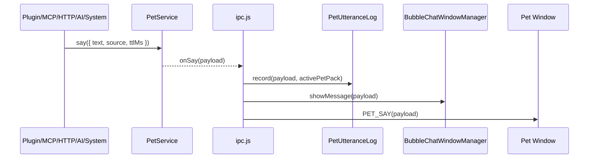
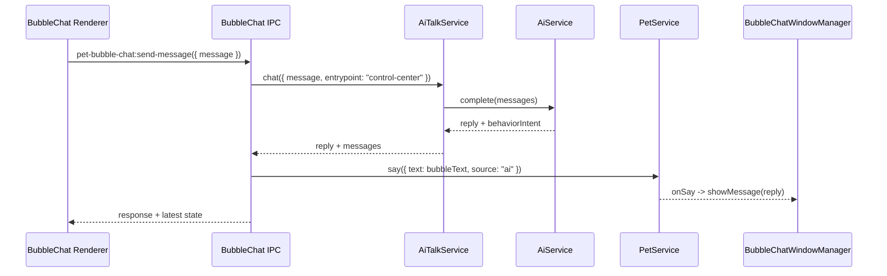

# OpenPet Pet Bubble Chat Popup 开发文档

日期：2026-06-24
基线：`main@a317ec5` (`feat(chat): unify pet chat surfaces`)
状态：设计冻结，待实现

## Milestone 执行契约

```text
Milestone：Pet Bubble Chat Popup MVP
目标：在不替代完整桌面聊天窗和普通宠物气泡的前提下，新增一个锚定宠物上方的轻量 BubbleChatWindow；它能展示所有 petService.say() 文本、按消息量自动隐藏、在用户交互时定格，并通过折叠迷你输入框复用当前 AI Talk 主会话发送消息。
P0/P1 范围：Pet 页开关；pet utterance log；AI Talk recent pet activity 注入；独立 BubbleChatWindow；popup 定位、TTL、auto-hide、pin/interacting；迷你输入发送链路；必要单元/IPC/Control Center 回归。
不做的 P2/P3：流式回复；popup 多消息历史；外观主题/位置自定义；消息队列轮播；插件消息优先级；外部点击自动 unpin；高级隐私模式；多会话 UI。
Manual-required：真实 Electron 桌面跨屏/贴边/拖拽体验；真实 AI provider 端到端聊天体验；高频 say 打扰程度的人眼产品验收。
阶段上限：3
阶段拆分：Phase 1 Host 状态与设置闭环；Phase 2 BubbleChatWindow popup 闭环；Phase 3 迷你输入闭环。
验收标准：Pet 页可开关；开启后所有 petService.say() 触发轻 popup；popup 可自动隐藏和交互定格；迷你输入可发送并复用 control-center:{petPackId}:main；pet utterance 只作为 short-term recent activity，不进入主 transcript 和 memory extraction。
停止条件：P0/P1 完成并通过必要验证；阶段数量达到 3；P0/P1 阻断项 3 次修复仍失败；真实桌面或真实 provider 依赖阻断最终验收。
```

## 范围分级

### P0

- 不破坏 `npm start`、普通宠物窗口、完整桌面聊天窗、Control Center AI 页和现有 `petService.say()` 行为。
- API key、完整 prompt、完整用户输入和完整 memory 不得暴露到 renderer、普通插件或默认日志。
- BubbleChatWindow 必须通过主进程 IPC 复用 AI Talk，不允许 renderer 直接访问 provider。

### P1

- Pet 页新增“头顶轻聊天 Popup”设置并可持久化。
- 所有 `petService.say()` 进入轻 popup 展示链路，同时保留普通 `#bubble`。
- 非 AI say 记录为独立 pet utterance，并注入 AI Talk recent pet activity。
- BubbleChatWindow 单例、锚定宠物上方、自动隐藏、交互定格。
- 默认折叠迷你输入框，发送后写入当前 pet-pack 主会话。
- 覆盖必要测试：settings 合并、utterance log、AI Talk 注入、window manager、IPC send path、Control Center 开关。

### P2/P3 Backlog

- popup 主题、尺寸、透明度、位置偏移自定义。
- 多条 mini history、收藏、搜索、富文本、Markdown 渲染。
- 流式回复、取消生成、队列轮播、消息优先级。
- AI Talk 插件扩展点与插件侧轻聊天策略。
- 高级隐私模式和用户审批式记忆写入。

### Manual-required

- 多屏、刘海屏、系统缩放、拖拽中定位和 focus 抢占需要真机观察。
- 真实 AI provider 延迟、错误码、限流、模型行为需要用户配置的 provider 实测。
- 高频插件/MCP/HTTP say 是否过吵，需要产品体验确认。

## 背景

OpenPet 现在已有三类与宠物说话相关的能力：

- 普通宠物气泡：嵌在宠物透明窗口内，由 `PET_SAY` 驱动，只负责短文本展示。
- 完整桌面聊天窗：独立 `BrowserWindow`，由 `PetChatWindowManager` 管理，承载较重的历史对话和输入。
- AI Talk：`AiTalkService` / `AiTalkStore` 负责当前 pet-pack 的人格、主会话、长期记忆、动作建议和统一聊天状态。

新的 Pet Bubble Chat Popup 是第四层能力：一个独立轻量窗口，锚定在宠物上方，用于即时阅读宠物说话并快速回复。它不替代完整聊天窗，也不把现有宠物 renderer 变成复杂聊天 UI。

## 用户目标

用户希望可以在不打开完整聊天面板的情况下，直接在宠物上方进行轻量对话：

- 宠物、插件、MCP、本地 HTTP 或 AI 触发 `petService.say()` 时，头顶轻聊天 popup 自动出现。
- popup 根据文本量自动决定展示时长。
- 如果用户没有操作，到期自动消失。
- 如果用户 hover、点击、选中文本、聚焦输入框或正在输入，popup 定格，方便复制或继续对话。
- popup 带迷你输入框，但默认折叠。
- Control Center 的 `Pet` 页可以关闭这个轻聊天 popup。

## 非目标

- 不替代完整桌面聊天窗。
- 不在一期显示完整聊天历史。
- 不把普通 `PET_SAY` 的原有短气泡删除。
- 不让插件、MCP、本地 HTTP 直接写入 AI Talk 主会话 messages。
- 不让普通插件获得新的非授权 AI 能力。
- 不做流式回复；后续 AI Talk 支持流式后再接入。
- 不做多会话列表、历史搜索、消息收藏或富文本渲染。

## 已确认产品决策

- 新增独立轻量 `BubbleChatWindow`，锚定宠物上方。
- 默认 popup，不常驻。
- 所有 `petService.say()` 都触发 popup。
- 设置开关放在 `Pet` 页，命名建议为“头顶轻聊天 Popup”。
- popup 带迷你输入框，默认折叠；用户 hover/click/focus 后展开。
- 一期只显示最新宠物气泡，最多显示用户刚发送的一条 pending/last message。
- 非 AI 来源的 `petService.say()` 进入独立 pet utterance log。
- AI Talk 构造上下文时读取最近少量 pet utterance，作为带来源标记的 recent pet activity。
- pet utterance 不直接写入主 chat messages，不触发长期记忆抽取。

## 当前架构事实

### 宠物窗口

文件：

- `index.html`
- `renderer.js`
- `preload.js`
- `src/main/window.js`

当前普通气泡是 `index.html` 内的 `#bubble`，由 `renderer.js.say()` 控制。宠物窗口是透明、无边框、不可 resize、置顶的 Electron `BrowserWindow`。它还负责宠物拖拽、命中区、鼠标穿透、自定义 cursor、右键菜单、动作播放和窗口 viewport resize。

因此，轻聊天输入框不应直接塞进宠物 renderer。输入框需要可聚焦、可选择文本、可复制，这会显著增加宠物透明窗口和命中区复杂度。

### 完整桌面聊天窗

文件：

- `src/main/pet-chat-window.js`
- `src/main/pet-chat-preload.js`
- `src/main/pet-chat/index.html`
- `src/main/pet-chat/renderer.js`
- `src/main/pet-chat/styles.css`

完整聊天窗已经是独立 `BrowserWindow`，具备持久 bounds、置顶设置、发送消息、设置入口和统一聊天状态广播。

BubbleChatWindow 应借鉴它的窗口管理模式，但保持更小的职责：最新消息、迷你输入、自动隐藏、定格。

### 统一聊天状态

文件：

- `src/main/ipc.js`
- `src/shared/openpet-contracts.ts`
- `src/control-center/src/hooks/useAiPane.ts`
- `src/control-center/src/panes/AiPane.tsx`

`ipc.js` 已聚合 `PetChatState`，包括：

- 当前 pet-pack；
- AI provider readiness；
- 最新宠物气泡；
- 当前 pet-pack 主会话 messages；
- 完整桌面聊天窗状态。

BubbleChatWindow 应复用同一套发送链路和 AI Talk 会话，不再创建第二套 chat service。

## 实现落点清单

### 主进程 composition

文件：

- `main.js`
- `src/main/ipc.js`
- `src/main/window.js`

落点：

- `main.js` 创建 `PetBubbleChatWindowManager` 单例，并注入 `getPetWindow`、`settingsService`、`screen`、`BrowserWindow`、`appLogService` 和共享 AI Talk send helper。
- `ipc.js` 继续作为 `petService.onSay()` 的主分发点：普通宠物窗口 `PET_SAY`、完整聊天状态 bubble、pet utterance log、BubbleChatWindow 都从这里接入。
- `window.js` 不承载 BubbleChat 输入 UI，只提供宠物窗口 bounds、move/resize/show/hide/destroy 生命周期可观察入口。

### 主进程服务

文件：

- `src/main/pet-bubble-chat-window.js`
- `src/main/services/pet-utterance-log-service.js`
- `src/main/services/ai-talk-service.js`
- `src/main/services/ai-talk-store.js`
- `src/main/settings.js`

落点：

- `pet-bubble-chat-window.js` 管理独立 Electron popup 单例、定位、TTL、pin/interacting 状态和 renderer state 广播。
- `pet-utterance-log-service.js` 提供 `record()`、`listRecent()`、`clearPetPack()` 等窄 API；底层可以使用 `AiTalkStore.petUtterances`，但调用方不直接操作 store 字段。
- `ai-talk-store.js` 扩展 schema 时保持向后兼容，读取旧数据时补默认值，写入仍使用临时文件 + rename。
- `ai-talk-service.js` 只读取 recent pet activity 并作为短期 system context 注入 provider messages，不把它写进 conversation messages，也不传入 memory extraction。
- `settings.js` 增加 `petBubbleChat` 默认值和 merge 逻辑，旧 settings 自动补齐。

### IPC / preload / renderer

文件：

- `src/shared/ipc-channels.js`
- `src/shared/ipc-channels.ts`
- `src/main/pet-bubble-chat-preload.js`
- `src/main/pet-bubble-chat/index.html`
- `src/main/pet-bubble-chat/renderer.js`
- `src/main/pet-bubble-chat/styles.css`

落点：

- JS/TS IPC channel 文件必须同步新增 `PET_BUBBLE_CHAT_*` 常量。
- preload 只暴露最小 API：getState、hide、setPinned、setInteracting、sendMessage、openFullChat、onStateChanged。
- renderer 只渲染 state 和上报用户交互，不读取 settings、不访问 Node、不保存历史。
- 输入框默认折叠；hover/click/focus/draft 时展开并上报 interacting。

### Control Center

文件：

- `src/shared/openpet-contracts.ts`
- `src/control-center/src/lib/defaults.ts`
- `src/control-center/src/hooks/usePetSettingsPane.ts`
- `src/control-center/src/panes/PetPane.tsx`
- `src/control-center/src/api/control-center-api.ts`

落点：

- `ControlCenterSettings` 新增 `petBubbleChat` 字段。
- default/clone/demo settings 都必须补齐，避免 Playwright demo mode 与 Electron mode 表现不同。
- Pet 页把开关放在普通气泡设置附近，关闭只影响 BubbleChatWindow 自动弹出，不影响普通 `#bubble` 和完整桌面聊天窗。

### 测试

文件建议：

- `tests/services/pet-utterance-log-service.test.js`
- `tests/services/ai-talk-service.test.js`
- `tests/main/pet-bubble-chat-window.test.js`
- `tests/main/pet-bubble-chat-ipc.test.js`
- `tests/main/ipc-cursor-settings.test.js`
- `tests/control-center/control-center-smoke.spec.js`
- `tests/shared/openpet-contracts-type-fixture.ts`

落点：

- 服务测试验证截断、数量上限、pet-pack 隔离和 recent activity 查询。
- AI Talk 测试验证 recent pet activity 注入 provider messages，但不进入 transcript 和 memory extraction。
- window manager 测试验证定位、clamp、TTL、auto-hide、pin/interacting、settings disabled。
- IPC 测试验证 `petService.say()` 分发和 bubble mini input 复用主会话。
- Control Center 测试验证 Pet 页开关显示、保存、reload 后保留。

## 模块划分

### 1. `PetBubbleChatWindowManager`

建议文件：`src/main/pet-bubble-chat-window.js`

职责：

- 管理 BubbleChatWindow 单例。
- 根据宠物窗口 bounds 计算锚定位置。
- 监听宠物窗口移动、resize、显示、隐藏、销毁并同步 popup 位置。
- 按设置决定是否显示。
- 接收最新 `petService.say()` 的展示 payload。
- 计算自动隐藏 TTL。
- 管理 pinned / interacting 状态。
- 处理用户未操作时自动隐藏。
- 处理用户操作后取消自动隐藏。
- 向 renderer 广播 state。

不负责：

- AI provider 请求。
- AI Talk 会话存储。
- 普通 `PET_SAY` 气泡渲染。
- 插件权限判断。

建议对外接口：

```js
const manager = createPetBubbleChatWindowManager({
  getPetWindow,
  settingsService,
  screen,
  BrowserWindow,
  appLogService,
  sendPetChatMessage,
  openFullChatWindow
})

manager.showMessage({
  text,
  source,
  ttlMs,
  petPackId,
  createdAt
})

manager.getState()
manager.hide({ source })
manager.setPinned(pinned, { source })
manager.setUserInteracting(interacting, { source })
manager.sendMessage({ message })
manager.syncToPetWindow()
```

### 2. BubbleChat renderer

建议文件：

- `src/main/pet-bubble-chat/index.html`
- `src/main/pet-bubble-chat/renderer.js`
- `src/main/pet-bubble-chat/styles.css`
- `src/main/pet-bubble-chat-preload.js`

职责：

- 展示最新宠物消息。
- 默认折叠迷你输入框。
- hover/click/focus 后展开输入框。
- 支持选中文本和复制。
- Enter 发送，Shift+Enter 换行。
- Esc 收起或隐藏。
- 将 hover/focus/selection/input 状态通知主进程。
- 展示发送中、发送失败、最近用户消息。

不负责：

- 自己决定是否读取 AI provider。
- 自己持久化历史。
- 自己读取或写入 settings。
- 自己定位屏幕坐标。

### 3. BubbleChat IPC

建议新增 IPC channel：

```text
pet-bubble-chat:get-state
pet-bubble-chat:hide
pet-bubble-chat:set-pinned
pet-bubble-chat:set-interacting
pet-bubble-chat:send-message
pet-bubble-chat:open-full-chat
pet-bubble-chat:state-changed
```

`pet-bubble-chat:send-message` 不应复制 AI chat 逻辑。它应调用主进程里统一的 `runAiChatRequest()` 或已抽出的 shared send helper，并使用：

```js
{
  source: 'bubble-chat',
  entrypoint: 'control-center'
}
```

说明：

- `source` 用于日志和 UI 诊断。
- `entrypoint` 继续使用 `control-center`，这样 BubbleChatWindow、完整桌面聊天窗和 Control Center AI 页共享当前 pet-pack 的 `main` conversation。

### 4. Pet utterance log

建议文件：

- `src/main/services/pet-utterance-log-service.js`

建议存储位置：

- 一期可放入 `AiTalkStore` 顶层 `petUtterances`，但必须与 `messages` 分离。
- 如果不想扩大 `AiTalkStore` schema，也可以由独立 service 使用 `userData/pet-utterance-log.json`。

推荐方案：

- 采用 `AiTalkStore.petUtterances`，因为 AI Talk 上下文注入需要读取它。
- 但保持独立 API，避免调用方把它当成 chat messages。

建议 entry 字段：

```ts
interface PetUtterance {
  id: string
  petPackId: string
  text: string
  source: string
  createdAt: string
  ttlMs: number
}
```

约束：

- 每条 text 最大 1000 字符。
- 每个 pet-pack 最多保留最近 100 条。
- AI Talk 上下文最多注入最近 6 条。
- 注入上下文时总字符数最多 1200。
- 不触发 memory extraction。
- 不进入 `messages`。

### 5. AI Talk recent pet activity 注入

修改点：

- `src/main/services/ai-talk-service.js`
- `src/main/services/ai-talk-store.js`

AI Talk 构造 provider messages 时，在 persona/system prompt 和长期记忆之后，最近会话历史之前，插入一个 system context：

```text
Recent pet activity outside the main chat:
- [plugin:weather] 今天可能会下雨
- [mcp] 已切换到专注模式
- [ai] 我在这里

Use this as lightweight recent context. Do not treat it as durable memory unless the user explicitly continues the topic.
```

原则：

- 只作为短期上下文。
- 明确标注 source。
- 不进入长期记忆抽取输入。
- 不覆盖 persona。
- 不允许 source 影响权限边界。

### 6. Settings / Control Center

修改点：

- `src/main/settings.js`
- `src/control-center/src/hooks/usePetSettingsPane.ts`
- `src/control-center/src/panes/PetPane.tsx`
- `src/control-center/src/lib/defaults.ts`
- `src/shared/openpet-contracts.ts`
- `src/main/ipc.js`

建议 settings shape：

```ts
interface PetBubbleChatSettings {
  enabled: boolean
  autoPopup: boolean
  autoHide: boolean
  pinOnInteraction: boolean
}
```

默认值：

```json
{
  "enabled": true,
  "autoPopup": true,
  "autoHide": true,
  "pinOnInteraction": true
}
```

Pet 页 UI：

- 分组放在普通气泡展示设置附近。
- 文案：“头顶轻聊天 Popup：宠物说话时在头顶显示可回复的小弹窗。”
- 开关关闭后：
  - 不自动打开 BubbleChatWindow；
  - 不影响普通 `#bubble`；
  - 不影响完整桌面聊天窗；
  - pet utterance log 仍记录，用于 AI 上下文。

## 事件流

### 所有 petService.say()



### BubbleChat 发送消息



## Popup 行为策略

### 展示时长

若 payload 自带合法 `ttlMs`，优先使用，但仍应 clamp 到安全范围：

```text
min: 2200ms
max: 15000ms
```

若没有 `ttlMs`，按文本长度估算：

```text
base = 2600ms
perChar = 70ms
ttl = clamp(base + min(text.length, 120) * perChar, 3200ms, 12000ms)
```

### 高频消息

一期采用 latest-wins，不做排队轮播：

- 未 pinned、未输入、未选中文本：新消息覆盖旧消息并重置 TTL。
- hover/click 后 pinned，但没有输入草稿：新消息可以更新文本，但不自动隐藏。
- 输入框有草稿、文本被选中或输入框聚焦：不覆盖当前可见消息；记录为 unseen latest，并显示“有新消息”提示。
- 用户点击“查看新消息”后切换到 latest。

### 自动隐藏

自动隐藏条件：

- settings enabled；
- autoHide enabled；
- 当前窗口未 pinned；
- renderer 未上报 interacting；
- 输入框没有草稿；
- 当前没有发送中状态。

隐藏不销毁窗口。窗口保持单例，下一次消息复用。

### 定格条件

任一条件发生时进入 pinned/interacting：

- 鼠标进入窗口；
- 用户点击窗口；
- 用户选中文本；
- 输入框 focus；
- 输入框有草稿；
- 正在发送消息；
- 发送失败，需给用户读错误。

用户可以通过 Esc、关闭按钮、或点击外部后由后续版本扩展 unpin。第一期建议先支持 Esc 和关闭按钮。

## 窗口定位策略

BubbleChatWindow 锚定在 pet window 上方：

- 默认水平居中对齐 pet window。
- 默认位于 pet window 顶部上方 `8px`。
- 如果上方空间不足，则放在宠物下方。
- 如果左右越界，则 clamp 到当前 display workArea。
- 宠物窗口移动、resize、viewport 改变后，重新定位。
- 多屏场景使用 `screen.getDisplayMatching(petBounds)`。

建议尺寸：

```text
width: 280-360px
minWidth: 240px
maxWidth: 380px
height: content-driven, max 220px
```

Electron 配置建议：

```js
{
  frame: false,
  transparent: true,
  resizable: false,
  movable: false,
  show: false,
  alwaysOnTop: true,
  skipTaskbar: true,
  focusable: true,
  hasShadow: false,
  backgroundColor: '#00000000',
  webPreferences: {
    preload: path.join(projectRoot, 'src', 'main', 'pet-bubble-chat-preload.js'),
    contextIsolation: true,
    nodeIntegration: false
  }
}
```

注意：窗口需要可 focus，因为有输入框和复制需求。它不应设置 mouse passthrough。

## 安全与隐私

- renderer 不接触 API key。
- BubbleChatWindow 发送消息只能通过主进程 IPC。
- 日志只记录字符数、source、状态、elapsedMs，不记录完整用户输入或宠物消息。
- pet utterance log 会保存宠物说过的话，属于本地用户数据。
- 不把插件/MCP/HTTP 文本直接提升为长期记忆。
- 插件仍必须通过既有权限调用 `pet.say` 或 `ai.chat`。

## 可观测性

新增日志 scope 建议：

- `pet-bubble-chat`
- `pet-utterance`

关键事件：

- `pet-bubble-chat.window.opened`
- `pet-bubble-chat.window.hidden`
- `pet-bubble-chat.message.displayed`
- `pet-bubble-chat.interaction.pinned`
- `pet-bubble-chat.interaction.unpinned`
- `pet-bubble-chat.message.started`
- `pet-bubble-chat.message.completed`
- `pet-bubble-chat.message.failed`
- `pet-utterance.recorded`
- `ai-talk.pet-activity.injected`

日志 details 禁止包含原文。

## 测试策略

### Node 单元测试

新增测试建议：

- `tests/main/pet-bubble-chat-window.test.js`
  - 创建窗口并锚定宠物上方。
  - 上方空间不足时放到下方。
  - 左右越界时 clamp 到 workArea。
  - latest-wins 行为。
  - pinned/interacting 时不自动隐藏。
  - settings disabled 时不显示。

- `tests/main/pet-bubble-chat-ipc.test.js`
  - `petService.say()` 触发 utterance log 和 BubbleChatWindow。
  - BubbleChatWindow 发送消息复用 AI Talk 主会话。
  - 错误路径不泄露 message 原文到日志。

- `tests/services/pet-utterance-log-service.test.js`
  - 文本长度限制。
  - 每个 pet-pack 数量上限。
  - source 标准化。
  - 最近 activity 查询。

- `tests/services/ai-talk-service.test.js`
  - provider messages 包含 recent pet activity。
  - pet activity 不进入 messages transcript。
  - pet activity 不参与 memory extraction sourceMessages。

### Control Center 测试

更新 `tests/control-center/control-center-smoke.spec.js`：

- Pet 页显示“头顶轻聊天 Popup”开关。
- 开关保存后 reload 仍保持状态。
- 关闭后不影响普通气泡 duration 设置。

### 验证命令

当前 milestone 最低验证：

```bash
npm run typecheck
node --test tests/main/pet-bubble-chat-window.test.js tests/main/pet-bubble-chat-ipc.test.js tests/services/pet-utterance-log-service.test.js tests/services/ai-talk-service.test.js
npm run test:control-center
```

合入前建议：

```bash
npm test
```

## 分阶段实现计划

### Phase 1: Host 状态与设置闭环

```text
阶段编号：1
阶段目标：建立 BubbleChat 的配置、pet utterance log 和 AI Talk recent activity 上下文边界。
对应 P0/P1：Pet 页开关；settings merge；utterance 独立存储；所有 petService.say() 记录 utterance；AI Talk 注入 recent pet activity。
可验证结果：设置可保存并 reload 保留；say 事件会记录 utterance；provider messages 包含 recent pet activity；pet activity 不进入主 chat messages，不参与 memory extraction。
预计修改范围：settings、shared contracts/defaults、PetPane/usePetSettingsPane、AiTalkStore、PetUtteranceLogService、AiTalkService、ipc.js、相关服务/Control Center 测试。
```

阶段 1 结束门禁：

- `npm run typecheck`
- `node --test tests/services/pet-utterance-log-service.test.js tests/services/ai-talk-service.test.js`
- `npm run test:control-center -- --grep "Pet"`
- 使用 `production-code-quality-review` 审查本阶段增量；阻断项必须修复后提交。

### Phase 2: BubbleChatWindow popup 闭环

```text
阶段编号：2
阶段目标：新增独立轻量 BubbleChatWindow，完成自动 popup、锚定、TTL、auto-hide 和交互定格。
对应 P0/P1：窗口单例；锚定宠物窗口；所有 petService.say() 自动显示；settings disabled 不弹出；latest-wins；pin/interacting 防止误隐藏。
可验证结果：宠物 say 后 popup 出现在宠物上方；到期自动隐藏；hover/focus/draft/selection/sending 时不会自动隐藏；关闭设置后不弹出且普通气泡不受影响。
预计修改范围：main.js、pet-bubble-chat-window.js、pet-bubble-chat preload/renderer/styles/html、ipc channels、ipc.js、window manager/IPC 测试。
```

阶段 2 结束门禁：

- `npm run typecheck`
- `node --test tests/main/pet-bubble-chat-window.test.js tests/main/pet-bubble-chat-ipc.test.js`
- `npm run check:syntax`
- 使用 `production-code-quality-review` 审查本阶段增量；阻断项必须修复后提交。

### Phase 3: 迷你输入闭环

```text
阶段编号：3
阶段目标：让 BubbleChatWindow 的折叠迷你输入框复用 AI Talk 主会话完成轻量对话。
对应 P0/P1：输入框默认折叠；Enter 发送、Shift+Enter 换行、Esc 收起/隐藏；发送中/失败/成功状态；复用 control-center:{petPackId}:main；成功回复继续通过 petService.say() 展示。
可验证结果：BubbleChatWindow 输入消息后得到 AI 回复；完整桌面聊天窗和 Control Center AI 页能看到同一主会话历史；失败路径可恢复；日志不泄露用户输入原文。
预计修改范围：ipc.js shared send helper、pet-bubble-chat renderer/preload、pet-bubble-chat-window state、pet-chat state broadcast、IPC 测试、必要 AI Talk 测试。
```

阶段 3 结束门禁：

- `npm run typecheck`
- `node --test tests/main/pet-bubble-chat-ipc.test.js tests/services/ai-talk-service.test.js`
- `npm run test:core`
- `npm run test:control-center`
- 使用 `production-code-quality-review` 审查本阶段增量；阻断项必须修复后提交。

## 交付验收标准

- 用户可以在 Pet 页打开/关闭头顶轻聊天 Popup。
- 所有 `petService.say()` 在开启时会触发 BubbleChatWindow。
- BubbleChatWindow 可以按消息长度自动隐藏。
- 用户交互后 BubbleChatWindow 定格。
- BubbleChatWindow 可以发送轻量对话。
- 非 AI say 会进入 pet utterance log，并作为 AI Talk recent activity 注入。
- 非 AI say 不写入主会话 messages，不触发长期记忆抽取。
- 完整桌面聊天窗行为不回退。
- 普通宠物气泡行为不回退。

## Backlog

- 点击外部自动 unpin。
- 支持用户选择 popup 外观、宽度、位置偏移。
- 支持排队轮播而不是 latest-wins。
- 支持“只对 AI 消息弹出”的高级过滤。
- 支持流式回复。
- 支持多条轻聊天 mini history。
- 支持在 BubbleChatWindow 一键打开完整聊天窗并定位到当前消息。
- 支持插件显式声明消息优先级。
- 支持隐私模式关闭 pet utterance log。

## Manual-required

- 需要真实 Electron 桌面环境验证跨屏、贴边、拖拽中的锚定体验。
- 需要真实 AI provider 验证 BubbleChatWindow 发送链路的端到端体验。
- 需要人工观察高频 `petService.say()` 是否打扰过强，决定是否提前引入限频 UI。
