# One-Click Character Import And Action Generation Development Plan

> Date: 2026-07-01
> Status: active implementation spec (scope frozen for current round)
> Scope: define the next bounded milestone for a user-first Creator Studio flow in OpenPet

## Current Round Freeze

This spec is the authority for the current bounded implementation round.

Current execution scope:

- Stage 1 is complete: host reference persistence, workflow orchestration, and renderer-safe IPC/contracts
- Stage 2 is the active implementation stage: Control Center `Create` default user path
- Do not start Stage 3 Creator Studio alignment work in this round unless a true Stage 2 P0/P1 blocker requires a minimal compatibility fix

Current round success gate:

- Stage 2 deliverables compile, boot, and pass the required Control Center and Node validation for this delta
- Review finds no remaining P0/P1 blockers in the Stage 2 delta
- The round stops after the Stage 2 summary and does not auto-expand into Stage 3

## Implementation Snapshot (2026-07-02)

This section records what is already implemented on the active development branch so the spec can act as both plan and execution guide.

### Already landed in the current milestone branch

- Stage 1 host groundwork is implemented:
  - `creator-reference-service` persists canonical references in host-owned storage
  - `creator-workflow-service` exposes a single host orchestration path for new-character and existing-character flows
  - renderer-safe Creator IPC/contracts exist for state lookup and one-click generation
- The ordinary-user `Create` tab is implemented in the Control Center branch delta:
  - mode switch for `New Character` and `Existing Character`
  - provider readiness gate shown in the user-facing surface
  - required-input blocking before generation starts
  - single in-progress state once generation begins
  - success state with immediate "click the pet to verify" guidance
  - advanced fallback entry to Creator Studio details
- Control Center startup no longer depends on eager Creator loading:
  - `Create` state is lazy-loaded only when the `Create` tab is active
  - provider state for `Create` no longer blocks the rest of Control Center boot

### Still required before this round can close

- Re-run the Node core verification spine against the updated host service graph.
- Resolve any runtime/bootstrap regressions introduced by the new Creator service injection points.
- Confirm the advanced Creator Studio dashboard still works as a compatible fallback for run inspection and handoff debugging.

### Practical reading of the current round boundary

- Stage 2 is still the milestone owner: the default `Create` path is the primary deliverable.
- Minimal Stage 3 fixes are allowed only when they are required to keep the Stage 2 path or existing advanced dashboard working.
- This round does not expand into new asset semantics, new trigger UX, or new Codex pack mutation behavior.

## Goal

Ship a production-oriented default workflow for ordinary users:

`upload image -> choose new character or existing character -> generate and import -> click to verify immediately`

The design must hide Creator Studio task complexity by default, while preserving the advanced dashboard and manual command flow for debugging and power users.

## Current Execution Checklist

Use this checklist when continuing implementation in this milestone:

- Keep the ordinary-user path centered in `Create`, not `Plugins`.
- Keep the default provider path as the only happy-path entry.
- Do not interrupt the user mid-flow once generation starts.
- End existing-character success in a real applied `clickAction`, not a proposal-only handoff.
- Treat Creator Studio as advanced fallback and diagnostics, not as required primary navigation.
- Stop the round once the bounded verification spine is green and review finds no P0/P1 blockers.

## Product Principles

### Ordinary-user first

- The default path is the `provider` path, not the plugin dashboard path.
- A normal user should not need to understand runs, drafts, QA states, or trigger proposals.
- The main success definition is "generated asset is usable immediately inside OpenPet".

### Double-layer interaction model

- Default layer: `Create` tab with one primary-button flow.
- Advanced layer: Creator Studio dashboard for run inspection, manual step execution, and debugging.
- Advanced controls stay available, but the default layer must not depend on them.

### No mid-flow interruption

- After the user submits a valid request, the host should continue through generation, approval, import, and default binding automatically.
- The flow should only stop early for hard blockers such as missing reference input, provider-not-ready, or import failure.
- "Review details" is a secondary option after the system has already attempted the main path.

## Milestone Contract

```text
Milestone：
One-click character import and one-click custom action generation

目标：
让普通用户在 Control Center 中走一条默认主路径，
完成“新图导入新角色”与“已有可编辑角色一键生成动作”两条闭环，
并且结果在 OpenPet 内可立即验证。

P0/P1 范围：
- 新角色走 Codex pet/full-pet 导入链路
- 新角色绑定并持久化一张 canonical reference
- 已有角色走当前 editable action 导入链路
- 已有角色复用或首次绑定 canonical reference
- 默认主路径从 Control Center Create 发起
- 已有角色导入后自动应用 clickAction
- Creator Studio 高级面板继续可用

不做的 P2/P3：
- 已导入 Codex pet pack 的后续自定义动作扩展
- 多参考图、多动作批量生成
- 新的 Codex 行布局或新 atlas 语义
- 富规则触发器编辑体验
- 动作历史图库与版本回滚

Manual-required：
- 人工确认模型产图质量
- 人工确认动作美术可接受性

阶段上限：
3

阶段拆分：
1. Host reference persistence + workflow orchestration + IPC
2. Control Center Create 默认主路径
3. Creator Studio / import alignment + verification + review fixes

验收标准：
- 用户可从一张图生成并导入一个新角色，且可立即在 OpenPet 中验证
- 用户可对当前可编辑角色一键生成自定义动作，导入后 clickAction 立即生效
- 高级 Creator Studio 与 Actions 管理面板不回归

停止条件：
- 当前 milestone 的两条默认主路径完成并通过必要验证
- 或阶段达到上限
- 或出现 3 次修复后仍未解决的 P0/P1 阻断
- 或缺少外部依赖导致当前环境无法完成验收
```

### Milestone

One-click character import and one-click custom action generation

### User outcome

- A user can import a new character from one image.
- A new character receives the fixed Codex default action set.
- A user can generate a custom action for an existing editable character in one click.
- The generated action becomes immediately testable through click behavior.

### P0/P1 scope

- New character flow uses the Codex pet pipeline.
- New character flow persists one canonical reference image.
- Existing character flow uses the current editable action pipeline.
- Existing character flow persists and reuses a canonical reference image.
- Default user flow is hosted in Control Center, not hidden inside Plugins-only tooling.
- Existing character custom action import auto-binds to `clickAction`.
- Advanced Creator Studio dashboard remains available.

### Not in this milestone

- Adding custom actions to already imported Codex pet packs.
- Multi-reference-image generation.
- Batch generation or multi-action generation in one request.
- New Codex atlas row definitions beyond the current fixed 9-row layout.
- Rich rule-editor UX for random/state/event triggers.

### Manual-required

- Real provider quality review for generated images.
- Human acceptance of art quality, not just technical chain success.

### Stage limit

3 stages

## Confirmed Product Decisions

### 1. New character and existing character do not use the same mutable asset model

- New character creation goes through the Codex pet import path.
- Existing character custom action generation goes through the current editable action path.
- This is a deliberate split model, aligned with the current architecture.

### 2. New character uses the current fixed Codex action set

The milestone reuses the existing Codex rows and does not redefine them:

- `idle`
- `running-right`
- `running-left`
- `waving`
- `jumping`
- `failed`
- `waiting`
- `running`
- `review`

### 3. Reference image is a first-class input

- The primary flow requires image selection before generation starts.
- Reference image is not treated as a late follow-up question.
- The first imported image becomes the character's canonical reference.

### 4. Existing characters must have a durable canonical reference

- If a character already has a stored reference, reuse it automatically.
- If it does not, require a one-time bind before first custom-action generation.
- Future custom actions reuse the stored reference by default.

### 5. Default trigger behavior for generated custom actions is click

- Existing character one-click action generation must end with the action immediately usable.
- The default binding is `clickAction`.
- Manual, unbound, random, state, and event remain advanced options.

## Current Architecture Facts

### Current new-pet path

Current files:

- `src/main/pet-pack/codex-pet.js`
- `src/main/pet-pack/loader.js`
- `examples/plugins/creator-studio/lib/real-atlas-builder.js`
- `examples/plugins/creator-studio/commands/import-approved-pet.js`

Current behavior:

- Codex pets are normalized from `pet.json` plus `spritesheetPath`.
- The atlas format is fixed to the current 8x9, 192x208-per-cell contract.
- Creator Studio full-pet import already uses the pet-pack import bridge.

### Current existing-action path

Current files:

- `src/main/services/action-import-service.js`
- `examples/plugins/creator-studio/commands/import-approved-action.js`
- `src/main/services/action-service.js`

Current behavior:

- Action-frame import copies generated frames into the current editable action workspace.
- Import regenerates sprite/config output for the host action set.
- Trigger behavior is currently handed off through proposals instead of always ending in an immediately usable default binding.

### Current default flow surface

Current files:

- `src/main/services/creator-studio-default-flow-service.js`
- `src/main/ipc/register-plugin-ipc.js`
- `src/control-center/src/hooks/usePluginsPane.ts`
- `src/control-center/src/panes/PluginsPane.tsx`

Current behavior:

- "Generate and import" is currently exposed under `Plugins`.
- The default flow still depends on Creator Studio plugin/service runtime state.
- The current UX is developer-facing rather than ordinary-user-facing.

### Current generation-task model

Current files:

- `examples/plugins/creator-studio/lib/generation-task.js`
- `examples/plugins/creator-studio/lib/task-workflow.js`
- `examples/plugins/creator-studio/lib/openpet-prompt-builder.js`
- `examples/plugins/creator-studio/lib/host-model-bridge.js`
- `examples/plugins/creator-studio/lib/run-store.js`

Current behavior:

- Generation tasks already distinguish `single-action` and `full-pet`.
- `styleSource` already models `currentPet`, `referenceImage`, and `textOnly`.
- `currentPet` currently behaves more like prompt guidance than a true persisted image input.
- Run workspace already reserves `inputs/references/`, which is a natural place to copy per-run reference assets.
- The current provider bridge does not yet send the actual reference image to the generation model, so `referenceImage` is currently a persisted workflow input and prompt/build signal, not true image-conditioned generation.

## Product Surface Design

## Default surface

Add a new ordinary-user Control Center entry dedicated to creation.

Recommended tab:

- `Create`

Why:

- `Pet` is current runtime settings.
- `Actions` is advanced action/trigger management.
- `Plugins` is developer or maintainer tooling.
- The new flow needs a user-facing home that does not expose plugin internals.

## Create tab modes

### Mode A: New Character

Inputs:

- Character name
- One reference image
- Optional short style or identity prompt

Primary action:

- `Generate Character`

Result:

- Save canonical reference
- Generate full-pet Codex output
- Import pack
- Activate imported pack
- Show success CTA: click the pet to verify

### Mode B: Existing Character

Inputs:

- Target character
- Reference status
- If no stored reference exists: one-time reference upload
- Action name
- Action description

Primary action:

- `Generate Action`

Result:

- Reuse canonical reference
- Generate single action
- Import frames
- Auto-apply `clickAction`
- Show success CTA: click the pet to verify

## Advanced surfaces that remain

- `Plugins -> Creator Studio` keeps command/debug access.
- Creator Studio dashboard keeps draft/review/repair/approve/import detail.
- `Actions` keeps trigger proposal inbox and trigger-rule management.

The default flow must never require a normal user to open these advanced surfaces.

## End-To-End Data Flow

### New character



```mermaid
flowchart LR
  A["Create tab: new character"] --> B["Host validates name + reference"]
  B --> C["Host persists canonical reference"]
  C --> D["Host starts Creator workflow"]
  D --> E["Creator Studio task: full-pet + referenceImage"]
  E --> F["Provider image generation through host bridge"]
  F --> G["Atlas + pet pack build"]
  G --> H["Host imports pack and activates pet"]
  H --> I["UI success: click pet to verify"]
```

### Existing editable character action

```mermaid
flowchart LR
  A["Create tab: existing character"] --> B["Host resolves editable target + canonical reference"]
  B --> C["Host binds reference if missing"]
  C --> D["Host starts Creator workflow"]
  D --> E["Creator Studio task: single-action + referenceImage"]
  E --> F["Provider image generation through host bridge"]
  F --> G["Action frame derivation + QA artifacts"]
  G --> H["Host imports action into editable action pipeline"]
  H --> I["Host applies clickAction immediately"]
  I --> J["UI success: click pet to verify"]
```



## Target Architecture

## Boundary split

### Main process / host owns

- Canonical reference persistence
- Workflow orchestration
- Task creation inputs
- Import decisions
- Post-import trigger application
- Secret-safe provider execution
- User-facing IPC for the new Create tab

### Creator Studio plugin owns

- Run workspace
- Generation task persistence
- Prompt build
- Provider image generation request through host bridge
- Action-frame building
- Codex atlas building
- QA artifacts
- Review/debug dashboard

### Control Center owns

- Default user-facing flow UI
- Progress and error state
- Required-input validation before starting generation
- Success state and immediate next-step guidance

## Responsibility Split

### Main page responsibilities

- Present `New Character` and `Existing Character` as explicit user choices.
- Require the user to provide all mandatory inputs before starting.
- Show one concise execution status instead of raw internal workflow steps.
- Expose advanced deep-link entry only as a secondary action.

### Plugin responsibilities

- Keep generation internals, run artifacts, prompt assembly, and image-to-frame or atlas transforms.
- Keep dashboard, task history, diagnostics, and repair tooling.
- Avoid owning user-facing canonical reference truth or default trigger decisions.

### Host responsibilities

- Own canonical reference truth, provider readiness checks, import completion, and immediate runtime usability.
- Translate one user action into the full command chain needed for successful import.
- Prevent renderer and plugin layers from holding secrets or becoming the authority for final pet or action activation.

## New host services

### `creator-reference-service`

Purpose:

- Persist and retrieve canonical character reference assets.

Responsibilities:

- Store reference images in a host-owned durable location.
- Associate references with character identity.
- Expose "has reference / bind reference / replace reference / read reference metadata".
- Copy reference files into Creator Studio run workspaces when a run starts.

Expected persistence shape:

- Character id
- Character type: `editable-action-host` or `pet-pack`
- Reference asset path
- Original file name
- Dimensions
- Content hash
- Created at
- Updated at

### `creator-workflow-service`

Purpose:

- Provide one stable host API for default creation flows.

Responsibilities:

- Validate required inputs
- Resolve target mode
- Resolve or bind canonical reference
- Create the correct generation task
- Invoke Creator Studio commands in the correct sequence
- Handle import
- Auto-apply `clickAction` for existing-character custom actions
- Return a UI-friendly state machine result

## Task model changes

### New character task

- `mode = full-pet`
- `targetPet = new`
- `styleSource = referenceImage`
- use copied run-local reference image

### Existing character custom action task

- `mode = single-action`
- `targetPet = current`
- `styleSource = referenceImage`
- use copied run-local reference image
- default trigger intent should be `click`

## Default flow sequence

### New character

1. User opens `Create`.
2. User chooses `New Character`.
3. User uploads one image and enters a name.
4. Host stores the image as canonical reference.
5. Host creates a Creator Studio full-pet task with `referenceImage`.
6. Creator Studio generates one source image through host-owned provider bridge.
7. Creator Studio builds the real Codex atlas and QA artifacts.
8. Host imports the produced pet pack.
9. Host activates the imported pack.
10. UI reports success and tells the user to click the pet to verify.

### Existing character custom action

1. User opens `Create`.
2. User chooses `Existing Character`.
3. UI resolves whether a canonical reference already exists.
4. If missing, UI requires one-time reference upload and host binds it.
5. User enters action name and motion description.
6. Host creates a Creator Studio single-action task with `referenceImage`.
7. Creator Studio generates one source image through host-owned provider bridge.
8. Creator Studio derives action frames and QA artifacts.
9. Host imports the action frames into the editable action pipeline.
10. Host applies the action as `clickAction`.
11. UI reports success and tells the user to click the pet to verify.

## Error model

The default Create flow should collapse internal workflow complexity into a few user-understandable states:

- missing-input
- provider-not-ready
- generating
- review-required
- import-failed
- completed

Advanced details such as run ids, QA artifacts, prompt provenance, and repair surfaces should be linked but not forced into the default flow.

## UX State Rules

- The primary CTA stays disabled until required inputs are complete.
- Once generation starts, the flow should present a single in-progress state and avoid asking the user follow-up questions.
- Success state must include exactly what became active: imported pet or imported action.
- Existing-character success state must confirm that `clickAction` now points at the new action.
- If the flow fails after a run exists, the UI should expose `Open Creator Studio details` without forcing it for the happy path.

## Required IPC And Contract Work

## New Control Center IPC

Add dedicated host IPC for create-flow operations instead of reusing the Plugins pane API directly.

Recommended operations:

- `creator:get-state`
- `creator:bind-reference`
- `creator:generate-new-character`
- `creator:generate-existing-action`
- `creator:get-last-run`

These channels should return renderer-safe view state only.

## API Draft

### `creator:get-state`

Returns:

- provider readiness
- editable-target summary
- canonical reference summary for current editable target
- last-run summary
- advanced dashboard availability

### `creator:bind-reference`

Input:

- target type
- target id
- local image path chosen by renderer

Returns:

- normalized reference metadata
- whether this was a first bind or replacement

### `creator:generate-new-character`

Input:

- character name
- optional style prompt
- reference image path

Returns:

- workflow status
- active pet metadata on success
- run summary for advanced detail entry

### `creator:generate-existing-action`

Input:

- action name
- motion prompt
- optional replacement reference image path

Returns:

- workflow status
- imported action metadata on success
- applied `clickAction` summary
- run summary for advanced detail entry

## Shared contracts

Add renderer-safe contract shapes for:

- character reference metadata
- create-flow request payloads
- create-flow progress/result state
- immediate success CTA metadata

Current contract home:

- `src/shared/openpet-contracts.ts`

## UI Work Plan

## Create tab

New files:

- `src/control-center/src/hooks/useCreatorPane.ts`
- `src/control-center/src/panes/CreatorPane.tsx`

Update:

- `src/control-center/src/App.jsx`
- `src/control-center/src/constants.ts`

Default UI sections:

- mode switch: `New Character` / `Existing Character`
- reference card
- action or character form
- progress card
- success card
- advanced fallback link: `Open Creator Studio details`

## Actions pane

Keep as advanced:

- trigger proposal inbox
- trigger rules
- manual action import

Do not make Actions the primary entry point for the one-click flow.

## Plugins pane

Keep:

- plugin install/review
- Creator Studio dashboard access
- command-level debugging

Do not keep the normal user path dependent on typing a natural-language prompt in the Plugins pane.

## Stage Plan

## Stage 1: Host reference persistence and workflow orchestration

Deliverables:

- `creator-reference-service`
- `creator-workflow-service`
- new IPC
- run-local reference copying into Creator Studio input workspace

Verification:

- unit tests for reference persistence
- unit tests for workflow task selection and failure mapping
- type/contract updates compile

## Stage 2: Control Center Create tab

Deliverables:

- new `Create` tab
- new-mode and existing-mode forms
- reference-required UX
- progress and success states

Verification:

- Control Center UI tests for new and existing modes
- smoke coverage for missing reference, provider not ready, and success flows

Current implementation note:

- This stage is already in execution on branch and should now be treated as a stabilization and verification phase, not a fresh design phase.

## Stage 3: Creator Studio and import-path alignment

Deliverables:

- explicit `referenceImage` task input support in default flow
- single-action import ends in auto-applied `clickAction`
- full-pet import stays Codex-compliant
- advanced dashboard remains compatible

Verification:

- core tests for action import and click binding
- Creator Studio integration tests
- packaged-app/non-demo UI smoke for Create tab if feasible in current environment

Current implementation note:

- Only compatibility and P0/P1 stabilization work belongs here in the current round.
- Any deeper Creator Studio UX redesign or new generation semantics stays in backlog unless a verified blocker forces it in.

## Acceptance Criteria

### New character

- User can upload one image and one name from Control Center.
- System generates a Codex pet using the fixed 9-row action set.
- Pack imports successfully and becomes active.
- User can immediately validate the imported pet in OpenPet.

### Existing character

- If reference exists, user can generate a new action without re-uploading.
- If reference does not exist, system blocks start until a one-time reference bind is complete.
- Generated action imports successfully.
- `clickAction` automatically switches to the imported action.
- User can immediately click the pet and see the new action.

### Advanced continuity

- Creator Studio dashboard still opens.
- Existing review and repair flows still work.
- Actions pane still manages trigger proposals and host trigger rules.

## Verification Matrix

### Core runtime

- Reference bind persists across app restart.
- Existing-character flow reuses stored reference without requiring re-upload.
- Existing-character import applies `clickAction` immediately after import.
- New-character flow activates the imported pet automatically.

### Control Center

- `Create` tab renders in non-demo UI.
- Missing-input states block submission cleanly.
- Provider-not-ready state is visible before generation starts.
- Success state provides the correct immediate verification instruction.

### Regression protection

- `Plugins -> Creator Studio` still opens and runs advanced flows.
- `Actions` pane manual import and trigger management still work.
- `npm start` remains functional with the new Create path enabled.

## Development Entry Points

Use these commands as the default verification spine for this milestone:

- `npm run typecheck`
- `npm run test:core`
- `npm run test:control-center`
- `npm start`

When closing the current branch round, also capture whether the following passed for the exact delta under review:

- `npm run build:control-center`
- `npm run check:node`

Use these only when the stage actually touches the matching surfaces:

- `npm run smoke:creator-studio-provider`
- `npm run run-packaged-creator-studio-ui-e2e`

## Stage Exit Gates

### Stage 1 gate

- host services compile and boot
- IPC contracts are renderer-safe
- reference persistence and workflow orchestration have unit coverage

### Stage 2 gate

- `Create` tab exists in non-demo Control Center
- both modes block correctly on missing required input
- progress and success states are visible without opening `Plugins`

### Stage 3 gate

- existing-character import ends in immediate `clickAction` usability
- Creator Studio advanced dashboard remains compatible
- packaged-app or equivalent non-demo smoke confirms the default path still works

## Risks And Mitigations

### Risk: current `currentPet` style guidance is too weak

Mitigation:

- treat `referenceImage` as the default style source for both target flows
- do not rely on prompt-only style continuity for the new default flow

### Risk: `referenceImage` is not yet true provider-side image conditioning

Mitigation:

- make host-owned canonical reference persistence real in this milestone
- make run-local reference copying real in this milestone
- keep prompts and task metadata aligned with reference usage
- do not claim true image-conditioned generation is complete until host model bridge and provider path actually transmit the reference asset

### Risk: mutable action model and Codex pack model diverge further

Mitigation:

- keep the split explicit in both code and UI
- do not pretend that imported Codex packs support custom-action mutation in this milestone

### Risk: existing proposal handoff leaves a half-finished UX

Mitigation:

- host default flow must apply `clickAction` directly after successful existing-character action import
- advanced trigger proposal surfaces remain available, but are not required for default success

### Risk: user cannot tell whether generation succeeded

Mitigation:

- success state must always end with an immediate action CTA: click the pet now

## Out-of-Scope Backlog

- Custom actions for already imported Codex pet packs
- Replaceable default Codex action groups
- Multiple references per character
- Reference-image version history and rollback
- Better generated motion diversity than current action-frame derivation
- Rich trigger-rule authoring UI with scheduler/state/event editors
- Gallery/history of generated actions per character

## File Map

Primary current files affected by this plan:

- `src/main/services/creator-studio-default-flow-service.js`
- `src/main/services/action-service.js`
- `src/main/services/action-import-service.js`
- `src/main/services/pet-pack-service.js`
- `src/main/ipc/register-plugin-ipc.js`
- `src/shared/ipc-channels.js`
- `src/shared/openpet-contracts.ts`
- `src/control-center/src/App.jsx`
- `src/control-center/src/constants.ts`
- `src/control-center/src/hooks/usePluginsPane.ts`
- `src/control-center/src/hooks/useActionsPane.ts`
- `examples/plugins/creator-studio/lib/generation-task.js`
- `examples/plugins/creator-studio/lib/task-workflow.js`
- `examples/plugins/creator-studio/lib/openpet-prompt-builder.js`
- `examples/plugins/creator-studio/lib/host-model-bridge.js`
- `examples/plugins/creator-studio/lib/run-store.js`

## Development Rule For This Milestone

When implementation starts, prefer this execution order:

1. host-side reference persistence and orchestration
2. explicit contracts and IPC
3. Control Center default surface
4. Creator Studio task/input alignment
5. tests and smoke verification

This keeps the milestone user-outcome-first while preserving current architecture boundaries.

## Exit Condition For The Milestone

The milestone is done when both default user paths are true in the packaged app and non-demo Control Center runtime:

- a user can generate and import a new character from one reference image
- a user can generate and immediately click-test a custom action for the current editable character

Anything beyond those two closed loops remains backlog unless it blocks them directly.

## Current Round Close-Out Notes

Before declaring this round complete, the final report should explicitly answer:

- Does `Create` exist and behave as the ordinary-user primary path in non-demo UI?
- Does existing-character generation end in an actually applied `clickAction`?
- Does the advanced Creator Studio dashboard still open and remain usable for run detail/debugging?
- Did the runtime bootstrap and Control Center verification spine pass on the exact branch head being delivered?

If any answer is "no", the work stays inside this milestone only if it blocks the two promised user loops above.
